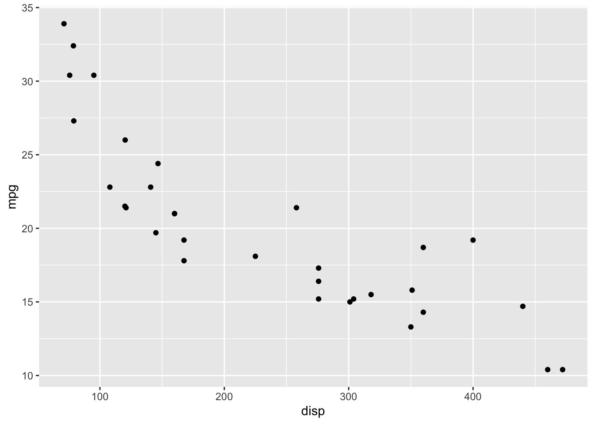
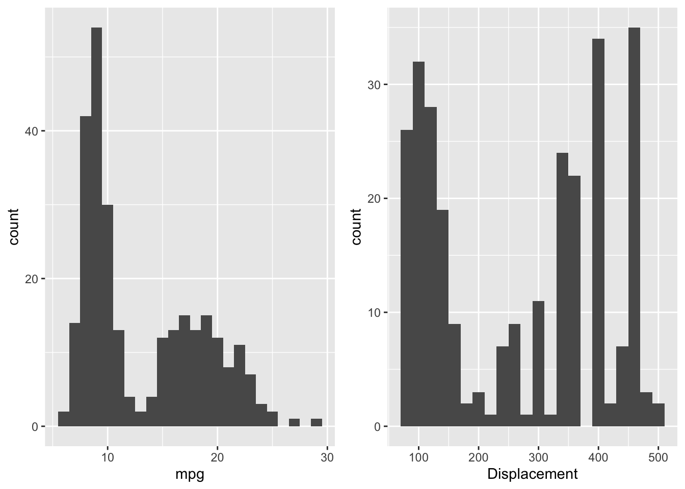
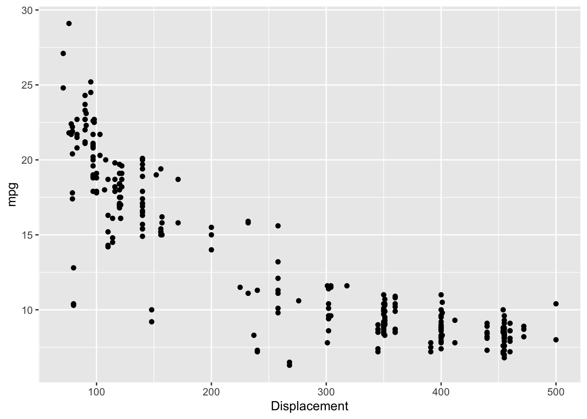

# Introduction {#intro}

## Resources

- [Bayesian Data Analysis](http://www.stat.columbia.edu/~gelman/book/) by Andrew Gelman, et. al.

- [A First Course in Bayesian Statistical Methods](https://pdhoff.github.io/book/) by Peter Hoff

- [Statistical Rethinking](https://xcelab.net/rm/statistical-rethinking/) by Richard McElreath

## A Motivating Example

Let's start with something familiar--the Monty Hall problem.  There are three doors labeled A, B and C. A car is behind one of the doors and a goat is behind each of the other two doors. You choose a door (let's say A). Monty Hall, who knows where the car actually is, opens one of the other doors (let's say B) revealing a goat.  Do you stay with door A or do you switch to door C?

We can frame the problem as follows:

1. Initially, you believe the car is equally likely to behind each door (i.e., $P[A=car]=P[B=car]=P[C=car]=\frac{1}{3}$).  Let's call this the _prior_ information.

2. Next, you can calculate the conditional probabilities that Monty Hall opened door B. Let's call this the _likelihood_.

\begin{align*}
  P[B=open | A=car] &= \frac{1}{2}\\
  P[B=open | B=car] &= 0 \\
  P[B=open | C=car] &=1
\end{align*}

3. Finally, you can update your beliefs with the new information.  Let's call your updated beliefs the _posterior_.

\begin{align*}
  P[A=car|B=open] &= \frac{P[B=open|A=car]P[A=car]}{P[B=open]} = \frac{1/2 * 1/3}{1/6 + 0 + 1/3} = \frac{1}{3} \\
  P[B=car|B=open] &= \frac{P[B=open|B=car]P[B=car]}{P[B=open]} = \frac{0 * 1/3}{1/6 + 0 + 1/3} = 0 \\
  P[C=car|B=open] &= \frac{P[B=open|C=car]P[C=car]}{P[B=open]} = \frac{1 * 1/3}{1/6 + 0 + 1/3} = \frac{2}{3}
\end{align*}
  
Clearly, you should switch to door C.  

This is a toy illustration of how to think about a model in a Bayesian framework:

$$posterior \propto likelihood * prior$$
(See the resources for a proper mathematical derivation.)

## Workflow

The workflow I'll follow in the subsequent chapters is as follows:

1. Define the model.
2. Examine the prior predictive distribution.
3. Examine diagnostic plots.
4. Examine posterior distribution.
5. Examine the posterior predictive distribution.

In general, this is an iterative process. At each step you may discover something that causes you to start over at step 1 with a new, refined model. 

## Data

For all of the examples, I use the mtcars data set and a model with mean centered _disp_ as the predictor and _mpg_ as the response. I start with a simple linear regression. However, as you can see from the scatterplot below, the relationship between _mpg_ and _disp_ is not linear, so I also fit a slightly more complex semi-parametric model. 

There are two reasons why I use mean centered _disp_:

1. Interpretation of the intercept is the average _mpg_ at the average value of displacement versus average _mpg_ at zero displacement (which has little practical meaning).

2. Several of the packages used in the examples assume priors are for mean-centered predictors for sampling efficiency.


```r
library(tidyverse)
library(datasets)
data(mtcars)
mtcars %>%
  ggplot(aes(x=disp, y=mpg)) +
  geom_point() 
```



## Prior Information

The `mtcars` dataset was extracted for Motor Trend magazine data on 1973-1974 models. The [1974 EPA Car Mileage Guide](https://www.fueleconomy.gov/feg/pdfs/guides/FEG1974.pdf) lists the mpg and engine size (i.e displacement) for U.S. cars and light duty trucks.  The data is plotted below.


```r
library(gridExtra)
library(here)

epa <- read.csv(here("data", "EPA_1974.csv"), header=TRUE)

p1 <- ggplot() +
  geom_histogram(data=epa, mapping=aes(x=mpg), binwidth = 1)

p2 <- ggplot(epa) +
  geom_histogram(mapping=aes(x=Displacement), binwidth=20) 

p3 <- ggplot(epa) +
  geom_point(mapping=aes(x=Displacement, y=mpg))

grid.arrange(p1, p2, ncol=2)
p3
```




