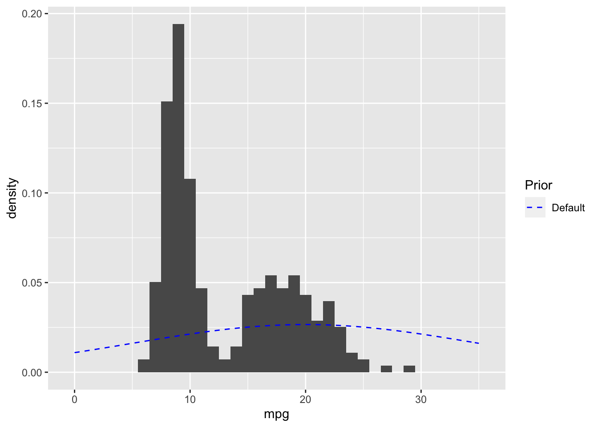
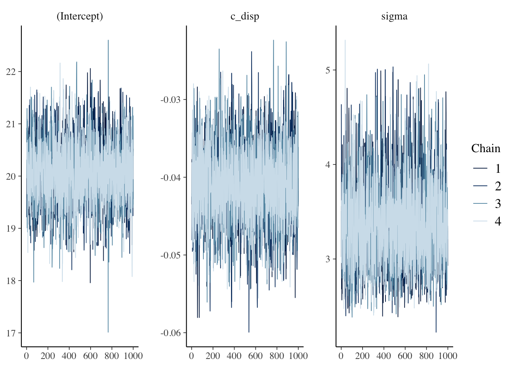
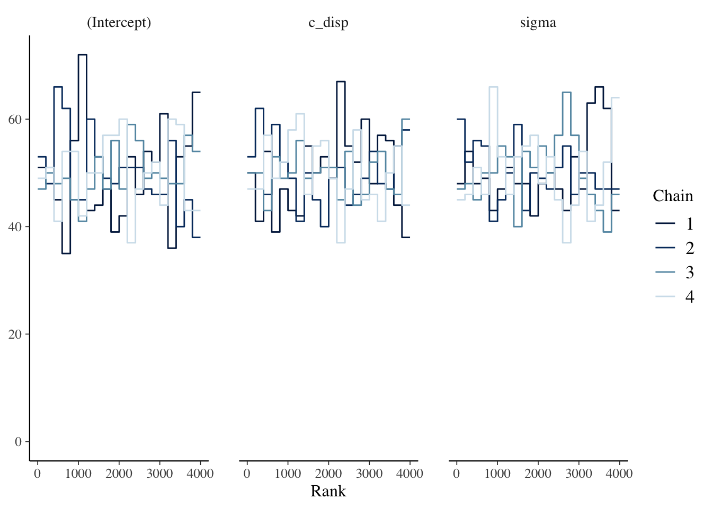
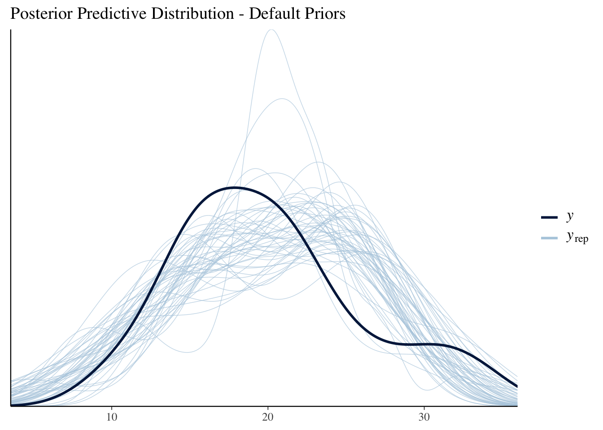

# rstanarm {#rstanarm}

## Resources

- [Regression and Other Stories](https://avehtari.github.io/ROS-Examples/index.html) by Gelman, Hill and Vehtari

- [rstanarm online documentation](https://mc-stan.org/users/interfaces/rstanarm)

## Description

The `rstanarm` package is one of the easiest ways to get started with Bayesian models. The functions parallel the frequentist functions you're probably already familiar with, and the syntax will also be familiar. You aren't required to explicitly choose priors because all of the functions have weakly informative priors by default (although some might argue _not_ being required to specify priors is a drawback). The primary limitation I've found thus far is the supported types for user-defined priors is somewhat limited.

## Environment Setup

```r
rm(list=ls())

set.seed(123)
options("scipen" = 1, "digits" = 4)

library(tidyverse)
library(gridExtra)
library(kableExtra)
library(datasets)
data(mtcars)

library(rstanarm)
library(bayesplot)

# Set number of cores
options(mc.cores = parallel::detectCores()-1)
```

## Linear Model (Default Priors)

### Define Model

Let's start with the following simple linear model:

\begin{align*}
  mpg &\sim N(\mu, \sigma^2) \\
  \mu &= a + b*disp \\
\end{align*}

The `stan_glm` function from the `rstanarm` package fits a Bayesian linear model.  The syntax is very similar to `lm`/`glm`.


```r
mdl1 <- stan_glm(mpg ~ disp, data = mtcars)
```
### Prior Predictive Distribution

Next, I'll examine the prior predictive distribution to see if the default priors seem reasonable.  The `prior_summary` function shows the default priors for the model as well as the adjusted priors after automatic scaling.  See http://mc-stan.org/rstanarm/articles/priors.html if you are interested in the details about how the default and adjusted priors are calculated. 


```r
prior_summary(mdl1)
```

```
## Priors for model 'mdl1' 
## ------
## Intercept (after predictors centered)
##   Specified prior:
##     ~ normal(location = 20, scale = 2.5)
##   Adjusted prior:
##     ~ normal(location = 20, scale = 15)
## 
## Coefficients
##   Specified prior:
##     ~ normal(location = 0, scale = 2.5)
##   Adjusted prior:
##     ~ normal(location = 0, scale = 0.12)
## 
## Auxiliary (sigma)
##   Specified prior:
##     ~ exponential(rate = 1)
##   Adjusted prior:
##     ~ exponential(rate = 0.17)
## ------
## See help('prior_summary.stanreg') for more details
```

Overlaying the default prior for the intercept with the EPA data gives a sense of what a weakly informative prior means for this data.




```r
# Plot prior predictive distribution using adjusted priors
N <- 100

prior_samples <- data.frame(a = rnorm(N, 20, 15),
                            b = rnorm(N, 0, 0.12))

D <- seq(min(mtcars$disp), max(mtcars$disp), length.out = N)

res <- as.data.frame(apply(prior_samples, 1, 
                           function(x) x[1] + x[2] * (D-mean(mtcars$disp)))) %>%
  mutate(disp = D) %>%
  pivot_longer(cols=c(-"disp"), names_to="iter") 

res %>%
  ggplot() +
  geom_line(aes(x=disp, y=value, group=iter), alpha=0.2) +
  labs(x="disp", y="prior predictive mpg")
```


I notice two things in the prior predictive distribution which seem unrealistic given what I know about the real world: 1) negative mpg and 2) increasing mpg as displacement increases. Later on I'll choose a more informative prior which incorporates this external knowledge. But let's proceed with the analysis and see what happens.

### Diagnostics

I'll walk through the steps for manually extracting the key diagnostic information from the `mdl1` object since I think that can be helpful to understand exactly what's going on.  However, once you have a handle on these steps I highly recommend the `shinystan` package; it will automatically create all of these diagnostic plots (and more) with an nice interactive web interface.

#### Trace Plots

The `bayesplot` package provides the function `mcmc_trace` which plots the Markov Chain Monte Carlo (MCMC) draws.


```r
mcmc_trace(mdl1, pars=c("disp", "sigma"))
```



There are three things I am looking for in the trace plot of each chain:

  1. *Good mixing* -  In other words, the chain is rapidly changing values across the full region versus getting "stuck" near a particular value and slowly changing.
  
  2. *Stationarity* - The mean of the chain is relatively stable.
  
  3. *Convergence* - All of the chains spend most of the time around the same high-probability value.
    
The trace plots above look good. 

#### Trace Rank Plots

It can sometimes be hard to interpret the trace plots when there are many chains. An alternative is the `mcmc_rank_overlay` function.  This function plots a trace rank plot which is the distribution of the ranked samples; if the four chains have a roughly uniform distribution that indicates good mixing.


```r
mcmc_rank_overlay(mdl1, pars=c("disp", "sigma"))
```


#### $\widehat{R}$ and Effective Sample Size

In addition to visually examining the chains, we should also check $\widehat{R}$ which is a measure of convergence.  $\widehat{R} > 1.0$ indicates poor mixing, and the `mc_stan` documentation recommends only using samples if $\widehat{R} < 1.05$.  However, a recent paper by @Vehtari_2020 recommends $\widehat{R} < 1.01$.

Since MCMC samples are usually correlated, the effective sample size (`n_eff`) is often less than the number of samples. There is no hard and fast rule for what is an acceptable number for `n_eff`. McElreath’s guidance is it depends on what you are trying to estimate. If you are interested mostly in the posterior mean, then `n_eff` = 200 can be enough. But if you are interested in the tails of the distribution and it’s highly skewed then you’ll need `n_eff` to be much larger. There are two parameters, `iter` and `warmup`, which you can adjust in `stan_glm` if a larger `n_eff` is needed.

The `summary` function displays `n_eff` and $\widehat{R}$ for the object returned by `stan_glm`.


```r
summary(mdl1)
```

```
## 
## Model Info:
##  function:     stan_glm
##  family:       gaussian [identity]
##  formula:      mpg ~ disp
##  algorithm:    sampling
##  sample:       4000 (posterior sample size)
##  priors:       see help('prior_summary')
##  observations: 32
##  predictors:   2
## 
## Estimates:
##               mean   sd   10%   50%   90%
## (Intercept) 29.6    1.3 27.9  29.6  31.2 
## disp         0.0    0.0  0.0   0.0   0.0 
## sigma        3.4    0.5  2.8   3.3   4.0 
## 
## Fit Diagnostics:
##            mean   sd   10%   50%   90%
## mean_PPD 20.1    0.9 19.0  20.1  21.2 
## 
## The mean_ppd is the sample average posterior predictive distribution of the outcome variable (for details see help('summary.stanreg')).
## 
## MCMC diagnostics
##               mcse Rhat n_eff
## (Intercept)   0.0  1.0  3501 
## disp          0.0  1.0  3328 
## sigma         0.0  1.0  3056 
## mean_PPD      0.0  1.0  3411 
## log-posterior 0.0  1.0  1529 
## 
## For each parameter, mcse is Monte Carlo standard error, n_eff is a crude measure of effective sample size, and Rhat is the potential scale reduction factor on split chains (at convergence Rhat=1).
```

### Posterior Distribution

Since the chains, `n_eff` and $\widehat{R}$ look good, let's examine the posterior distributions next.


```r
# Posterior point estimates (medians are used for point estimates)
coef(mdl1)
```

```
## (Intercept)        disp 
##    29.57206    -0.04103
```


```r
# 95% credible intervals
knitr::kable(posterior_interval(mdl1, prob=0.95))
```

<table>
 <thead>
  <tr>
   <th style="text-align:left;">   </th>
   <th style="text-align:right;"> 2.5% </th>
   <th style="text-align:right;"> 97.5% </th>
  </tr>
 </thead>
<tbody>
  <tr>
   <td style="text-align:left;"> (Intercept) </td>
   <td style="text-align:right;"> 27.0319 </td>
   <td style="text-align:right;"> 32.1255 </td>
  </tr>
  <tr>
   <td style="text-align:left;"> disp </td>
   <td style="text-align:right;"> -0.0509 </td>
   <td style="text-align:right;"> -0.0313 </td>
  </tr>
  <tr>
   <td style="text-align:left;"> sigma </td>
   <td style="text-align:right;"> 2.6281 </td>
   <td style="text-align:right;"> 4.3876 </td>
  </tr>
</tbody>
</table>


### Posterior Predictive Distribution

The `posterior_predict` function draws samples from the posterior predictive distribution. The `shinystan` package also generates nice plots of the posterior predictive distribution.

In this case, I'm going to plot the expected value of the posterior predictive distribution and overlay the observations since I think it can be easier to understand for someone new to these methods. The `posterior_linpred` function returns the linear predictor, possibly transformed by the inverse-link function.  The `posterior_epred` function returns the expectation over the posterior predictive distribution. In this example, the model is a Gaussian likelihood with an identity link function, so the two functions return identical results.


```r
newdata <- data.frame(disp=seq(min(mtcars$disp), max(mtcars$disp)))

y_rep <- as.data.frame(t(posterior_epred(mdl1, newdata=newdata, draws=50))) %>%
  cbind(newdata) %>%
  pivot_longer(cols=starts_with("V"), names_to="grp", values_to="mpg")

y_rep %>%
  ggplot(aes(x=disp, y=mpg)) +
  geom_line(aes(group=grp), alpha=0.2) +
  geom_point(data = mtcars) 
```


## Linear Model (User-Defined Priors)

Now I'll specify priors which incorporate my prior knowledge that `mpg` is non-negative and is non-increasing as `disp` increases.  My new model is as follows:

\begin{align*}
  mpg &\sim N(\mu, \sigma^2) \\
  \mu &= a + b*disp \\
  a &\sim Normal(25,10^2) \\
  b &\sim Normal(-0.2, 0.1^2) \\
  \sigma &\sim Exponential(1)
\end{align*}

The differences from the default priors are

1. The intercept prior has a slightly smaller variance so negative values of`mpg` are less likely.

2. The slope prior is no longer symmetric about 0, but rather it is centered at -0.2 so that positive values are less likely.

### Define Model


```r
mdl2 <- stan_glm(mpg ~ disp, data = mtcars,
                 prior = normal(-0.2, 0.1), # prior for slope
                 prior_intercept = normal(25,10), # prior for intercept
                 prior_aux = exponential(1))  # prior for standard deviation
```

### Prior Predictive Distribution


```r
cdisp <- mtcars$disp - mean(mtcars$disp)
tmp <- stan_glm(mpg ~ cdisp, data = mtcars,
                 prior = normal(-0.2, 0.1), # prior for slope
                 prior_intercept = normal(20,15), # prior for intercept
                 prior_aux = exponential(1),  # prior for standard deviation
                  prior_PD = TRUE, chains=1)
```

```
## 
## SAMPLING FOR MODEL 'continuous' NOW (CHAIN 1).
## Chain 1: 
## Chain 1: Gradient evaluation took 7.5e-05 seconds
## Chain 1: 1000 transitions using 10 leapfrog steps per transition would take 0.75 seconds.
## Chain 1: Adjust your expectations accordingly!
## Chain 1: 
## Chain 1: 
## Chain 1: Iteration:    1 / 2000 [  0%]  (Warmup)
## Chain 1: Iteration:  200 / 2000 [ 10%]  (Warmup)
## Chain 1: Iteration:  400 / 2000 [ 20%]  (Warmup)
## Chain 1: Iteration:  600 / 2000 [ 30%]  (Warmup)
## Chain 1: Iteration:  800 / 2000 [ 40%]  (Warmup)
## Chain 1: Iteration: 1000 / 2000 [ 50%]  (Warmup)
## Chain 1: Iteration: 1001 / 2000 [ 50%]  (Sampling)
## Chain 1: Iteration: 1200 / 2000 [ 60%]  (Sampling)
## Chain 1: Iteration: 1400 / 2000 [ 70%]  (Sampling)
## Chain 1: Iteration: 1600 / 2000 [ 80%]  (Sampling)
## Chain 1: Iteration: 1800 / 2000 [ 90%]  (Sampling)
## Chain 1: Iteration: 2000 / 2000 [100%]  (Sampling)
## Chain 1: 
## Chain 1:  Elapsed Time: 0.036544 seconds (Warm-up)
## Chain 1:                0.04268 seconds (Sampling)
## Chain 1:                0.079224 seconds (Total)
## Chain 1:
```

```r
prior_summary(tmp)
```

```
## Priors for model 'tmp' 
## ------
## Intercept (after predictors centered)
##  ~ normal(location = 20, scale = 15)
## 
## Coefficients
##  ~ normal(location = -0.2, scale = 0.1)
## 
## Auxiliary (sigma)
##  ~ exponential(rate = 1)
## ------
## See help('prior_summary.stanreg') for more details
```

```r
draws <- as.matrix(tmp) %>% head(100)
colMeans(draws)
```

```
## (Intercept)       cdisp       sigma 
##     21.3987     -0.1943      0.9352
```

```r
y <- apply(draws, 1, function(x) x[1] + x[2] * (D - mean(mtcars$disp))) %>%
  as_tibble() %>%
  mutate(disp=D) %>%
  pivot_longer(-disp, names_to="iter", values_to="mpg")
```

```
## Warning: The `x` argument of `as_tibble.matrix()` must have unique column names if `.name_repair` is omitted as of tibble 2.0.0.
## Using compatibility `.name_repair`.
## This warning is displayed once every 8 hours.
## Call `lifecycle::last_warnings()` to see where this warning was generated.
```

```r
y %>%
  ggplot() +
  geom_line(mapping=aes(x=disp, y=mpg, group=iter), alpha=0.2)
```


```r
# Plot prior predictive distribution using adjusted priors
N <- 100

prior_samples <- data.frame(a = rnorm(N, 20, 15),
                            b = rnorm(N, -0.2, 0.1))

D <- seq(min(mtcars$disp), max(mtcars$disp), length.out = N)

res <- as.data.frame(apply(prior_samples, 1, 
                           function(x) x[1] + x[2] * (D-mean(mtcars$disp)))) %>%
  mutate(disp = D) %>%
  pivot_longer(cols=c(-"disp"), names_to="iter") 

res %>%
  ggplot() +
  geom_line(aes(x=disp, y=value, group=iter), alpha=0.2) +
  labs(x="disp", y="prior predictive mpg")
```


Compared to the prior predictive distribution with the default priors, this looks more consistent with my real-world knowledge that was reflected in the priors.

### Diagnostics


```r
mcmc_trace(mdl2, pars=c("disp", "sigma"))
```




```r
summary(mdl2)
```

```
## 
## Model Info:
##  function:     stan_glm
##  family:       gaussian [identity]
##  formula:      mpg ~ disp
##  algorithm:    sampling
##  sample:       4000 (posterior sample size)
##  priors:       see help('prior_summary')
##  observations: 32
##  predictors:   2
## 
## Estimates:
##               mean   sd   10%   50%   90%
## (Intercept) 29.7    1.3 28.1  29.7  31.3 
## disp         0.0    0.0  0.0   0.0   0.0 
## sigma        3.2    0.4  2.7   3.2   3.7 
## 
## Fit Diagnostics:
##            mean   sd   10%   50%   90%
## mean_PPD 20.1    0.8 19.1  20.1  21.2 
## 
## The mean_ppd is the sample average posterior predictive distribution of the outcome variable (for details see help('summary.stanreg')).
## 
## MCMC diagnostics
##               mcse Rhat n_eff
## (Intercept)   0.0  1.0  2856 
## disp          0.0  1.0  2791 
## sigma         0.0  1.0  2921 
## mean_PPD      0.0  1.0  3370 
## log-posterior 0.0  1.0  1656 
## 
## For each parameter, mcse is Monte Carlo standard error, n_eff is a crude measure of effective sample size, and Rhat is the potential scale reduction factor on split chains (at convergence Rhat=1).
```
The trace plots, `n_eff` and $\widehat{R}$ all look good.

### Posterior Distribution

Now let's compare the posterior with informative versus default priors:


```r
# Point estimates
knitr::kable(cbind(coef(mdl1), coef(mdl2)), col.names = c("Default", "Informative"))
```

<table>
 <thead>
  <tr>
   <th style="text-align:left;">   </th>
   <th style="text-align:right;"> Default </th>
   <th style="text-align:right;"> Informative </th>
  </tr>
 </thead>
<tbody>
  <tr>
   <td style="text-align:left;"> (Intercept) </td>
   <td style="text-align:right;"> 29.572 </td>
   <td style="text-align:right;"> 29.6912 </td>
  </tr>
  <tr>
   <td style="text-align:left;"> disp </td>
   <td style="text-align:right;"> -0.041 </td>
   <td style="text-align:right;"> -0.0415 </td>
  </tr>
</tbody>
</table>


```r
# 95% credible intervals
knitr::kable(cbind(posterior_interval(mdl1, prob=0.95),
                  posterior_interval(mdl2, prob=0.95))) %>%
  add_header_above(c(" " = 1, "Default" = 2, "Informative" = 2))
```

<table>
 <thead>
<tr>
<th style="empty-cells: hide;border-bottom:hidden;" colspan="1"></th>
<th style="border-bottom:hidden;padding-bottom:0; padding-left:3px;padding-right:3px;text-align: center; " colspan="2"><div style="border-bottom: 1px solid #ddd; padding-bottom: 5px; ">Default</div></th>
<th style="border-bottom:hidden;padding-bottom:0; padding-left:3px;padding-right:3px;text-align: center; " colspan="2"><div style="border-bottom: 1px solid #ddd; padding-bottom: 5px; ">Informative</div></th>
</tr>
  <tr>
   <th style="text-align:left;">   </th>
   <th style="text-align:right;"> 2.5% </th>
   <th style="text-align:right;"> 97.5% </th>
   <th style="text-align:right;"> 2.5% </th>
   <th style="text-align:right;"> 97.5% </th>
  </tr>
 </thead>
<tbody>
  <tr>
   <td style="text-align:left;"> (Intercept) </td>
   <td style="text-align:right;"> 27.0319 </td>
   <td style="text-align:right;"> 32.1255 </td>
   <td style="text-align:right;"> 27.180 </td>
   <td style="text-align:right;"> 32.1083 </td>
  </tr>
  <tr>
   <td style="text-align:left;"> disp </td>
   <td style="text-align:right;"> -0.0509 </td>
   <td style="text-align:right;"> -0.0313 </td>
   <td style="text-align:right;"> -0.051 </td>
   <td style="text-align:right;"> -0.0322 </td>
  </tr>
  <tr>
   <td style="text-align:left;"> sigma </td>
   <td style="text-align:right;"> 2.6281 </td>
   <td style="text-align:right;"> 4.3876 </td>
   <td style="text-align:right;"> 2.531 </td>
   <td style="text-align:right;"> 4.1268 </td>
  </tr>
</tbody>
</table>

In this case, there is sufficient data that the choice of prior really didn't make much of a difference.

### Posterior Predictive Distribution


```r
newdata <- data.frame(disp=seq(min(mtcars$disp), max(mtcars$disp)))

y_rep <- as.data.frame(t(posterior_epred(mdl2, newdata=newdata, draws=50))) %>%
  cbind(newdata) %>%
  pivot_longer(cols=starts_with("V"), names_to="grp", values_to="mpg")

y_rep %>%
  ggplot(aes(x=disp, y=mpg)) +
  geom_line(aes(group=grp), alpha=0.2) +
  geom_point(data = mtcars) 
```


## Semi-parametric Model

### Define model

The linear model is a poor choice for this data, so I'll try a model with splines next. The `stan_gamm4` function from the `rstanarm` package fits Bayesian nonlinear (and mixed) models.


```r
mdl3 <- stan_gamm4(mpg ~ s(disp, bs="cr", k=7), 
                   data = mtcars, 
                   adapt_delta = 0.99)
```

### Prior Predictive Distribution

Unlike the linear model, it's not as straightforward to manually construct the prior predictive distribution.  Fortunately, `rstanarm` can automatically generate the prior predictive distribution too--we just refit the model _without_ conditioning on the data by setting `prior_PD = TRUE`.


```r
mdl3_prior_pred <- stan_gamm4(mpg ~ s(disp, bs="cr", k=7), 
                   data = mtcars, 
                   prior_PD = TRUE,
                   adapt_delta = 0.99)
```


```r
N <- 50

D <- seq(min(mtcars$disp), max(mtcars$disp), length.out = N)

prior_pred <- data.frame(t(posterior_epred(mdl3_prior_pred,
                                newdata=data.frame(disp=D),
                                draws=N)))

tmp <- prior_pred %>%
  mutate(disp = D)%>%
  pivot_longer(cols=-"disp", names_to="iter", values_to="mpg") 

tmp %>%
  ggplot() +
  geom_line(mapping=aes(x=disp, y=mpg, group=iter), alpha=0.2) +
  geom_point(data=mtcars, mapping=aes(x=disp, y=mpg), color="blue")
```



This prior predictive distribution gives us some crazy possibilities. However we saw earlier that there is enough data that the model isn't very sensitive to the choice of prior, so let's continue and see what happens.

### Diagnostics and Posterior


```r
mcmc_trace(mdl3, regex_pars=c("disp", "sigma"))
```


```r
summary(mdl3)
```

```
## 
## Model Info:
##  function:     stan_gamm4
##  family:       gaussian [identity]
##  formula:      mpg ~ s(disp, bs = "cr", k = 7)
##  algorithm:    sampling
##  sample:       4000 (posterior sample size)
##  priors:       see help('prior_summary')
##  observations: 32
## 
## Estimates:
##                       mean   sd   10%   50%   90%
## (Intercept)         20.1    0.4 19.5  20.1  20.6 
## s(disp).1            0.2    1.3 -1.2   0.2   1.6 
## s(disp).2           -0.9    1.1 -2.3  -0.8   0.3 
## s(disp).3            0.0    0.6 -0.7   0.0   0.7 
## s(disp).4            1.2    0.4  0.7   1.2   1.6 
## s(disp).5            0.4    0.1  0.2   0.4   0.6 
## s(disp).6           -3.1    0.3 -3.5  -3.1  -2.8 
## sigma                2.4    0.3  2.0   2.4   2.9 
## smooth_sd[s(disp)1]  1.2    0.7  0.5   1.0   2.1 
## smooth_sd[s(disp)2]  3.5    2.0  1.7   3.0   6.0 
## 
## Fit Diagnostics:
##            mean   sd   10%   50%   90%
## mean_PPD 20.1    0.6 19.3  20.1  20.9 
## 
## The mean_ppd is the sample average posterior predictive distribution of the outcome variable (for details see help('summary.stanreg')).
## 
## MCMC diagnostics
##                     mcse Rhat n_eff
## (Intercept)         0.0  1.0  3357 
## s(disp).1           0.0  1.0  3086 
## s(disp).2           0.0  1.0  2252 
## s(disp).3           0.0  1.0  4115 
## s(disp).4           0.0  1.0  2455 
## s(disp).5           0.0  1.0  4283 
## s(disp).6           0.0  1.0  3509 
## sigma               0.0  1.0  2720 
## smooth_sd[s(disp)1] 0.0  1.0  1229 
## smooth_sd[s(disp)2] 0.0  1.0  2250 
## mean_PPD            0.0  1.0  3322 
## log-posterior       0.1  1.0   842 
## 
## For each parameter, mcse is Monte Carlo standard error, n_eff is a crude measure of effective sample size, and Rhat is the potential scale reduction factor on split chains (at convergence Rhat=1).
```

The chains, `n_eff` and $\widehat{R}$ look good. In the Estimates section above, we also see the posteriors for the model parameters; there isn't an intuitive interpretation of the spline coefficients so I'll skip ahead to the posterior predictive distribution.

### Posterior Predictive Distribution

The expectation over the ppd is plotted below, along with a loess curve for comparison. This model is clearly a better fit to the data than the linear model.


```r
plot_nonlinear(mdl3, prob=0.95) +
  geom_point(mapping=aes(x=disp, y=mpg-mean(mpg)),
             data=mtcars) +
  labs(title="GAM", x="disp", y="mpg-mean(mpg)")

ggplot(mapping=aes(x=disp, y=mpg-mean(mpg)),
              data=mtcars) +
  geom_point()+
  stat_smooth(method="loess",
              level=0.95) +
  labs(title="LOESS")
```


## Session Info


```r
sessionInfo()
```

```
## R version 4.0.3 (2020-10-10)
## Platform: x86_64-apple-darwin17.0 (64-bit)
## Running under: macOS Big Sur 10.16
## 
## Matrix products: default
## BLAS:   /Library/Frameworks/R.framework/Versions/4.0/Resources/lib/libRblas.dylib
## LAPACK: /Library/Frameworks/R.framework/Versions/4.0/Resources/lib/libRlapack.dylib
## 
## locale:
## [1] en_US.UTF-8/en_US.UTF-8/en_US.UTF-8/C/en_US.UTF-8/en_US.UTF-8
## 
## attached base packages:
## [1] stats     graphics  grDevices datasets  utils     methods   base     
## 
## other attached packages:
##  [1] bayesplot_1.7.2  rstanarm_2.21.1  Rcpp_1.0.5       kableExtra_1.3.1
##  [5] gridExtra_2.3    forcats_0.5.0    stringr_1.4.0    dplyr_1.0.2     
##  [9] purrr_0.3.4      readr_1.4.0      tidyr_1.1.2      tibble_3.0.4    
## [13] ggplot2_3.3.2    tidyverse_1.3.0 
## 
## loaded via a namespace (and not attached):
##   [1] minqa_1.2.4          colorspace_2.0-0     ellipsis_0.3.1      
##   [4] ggridges_0.5.2       rsconnect_0.8.16     markdown_1.1        
##   [7] base64enc_0.1-3      fs_1.5.0             rstudioapi_0.13     
##  [10] farver_2.0.3         rstan_2.21.2         DT_0.16             
##  [13] fansi_0.4.1          lubridate_1.7.9.2    xml2_1.3.2          
##  [16] splines_4.0.3        codetools_0.2-16     knitr_1.30          
##  [19] shinythemes_1.1.2    jsonlite_1.7.1       nloptr_1.2.2.2      
##  [22] broom_0.7.2          dbplyr_2.0.0         shiny_1.5.0         
##  [25] compiler_4.0.3       httr_1.4.2           backports_1.2.0     
##  [28] Matrix_1.2-18        assertthat_0.2.1     fastmap_1.0.1       
##  [31] cli_2.2.0            later_1.1.0.1        htmltools_0.5.0     
##  [34] prettyunits_1.1.1    tools_4.0.3          igraph_1.2.6        
##  [37] gtable_0.3.0         glue_1.4.2           reshape2_1.4.4      
##  [40] V8_3.4.0             cellranger_1.1.0     vctrs_0.3.5         
##  [43] nlme_3.1-149         crosstalk_1.1.0.1    xfun_0.19           
##  [46] ps_1.4.0             lme4_1.1-26          rvest_0.3.6         
##  [49] mime_0.9             miniUI_0.1.1.1       lifecycle_0.2.0     
##  [52] renv_0.12.0          gtools_3.8.2         statmod_1.4.35      
##  [55] MASS_7.3-53          zoo_1.8-8            scales_1.1.1        
##  [58] colourpicker_1.1.0   hms_0.5.3            promises_1.1.1      
##  [61] parallel_4.0.3       inline_0.3.17        shinystan_2.5.0     
##  [64] yaml_2.2.1           curl_4.3             loo_2.3.1           
##  [67] StanHeaders_2.21.0-6 stringi_1.5.3        highr_0.8           
##  [70] dygraphs_1.1.1.6     boot_1.3-25          pkgbuild_1.1.0      
##  [73] rlang_0.4.9          pkgconfig_2.0.3      matrixStats_0.57.0  
##  [76] evaluate_0.14        lattice_0.20-41      labeling_0.4.2      
##  [79] rstantools_2.1.1     htmlwidgets_1.5.2    tidyselect_1.1.0    
##  [82] processx_3.4.5       plyr_1.8.6           magrittr_2.0.1      
##  [85] bookdown_0.21        R6_2.5.0             generics_0.1.0      
##  [88] DBI_1.1.0            mgcv_1.8-33          pillar_1.4.7        
##  [91] haven_2.3.1          withr_2.3.0          xts_0.12.1          
##  [94] survival_3.2-7       modelr_0.1.8         crayon_1.3.4        
##  [97] rmarkdown_2.5        grid_4.0.3           readxl_1.3.1        
## [100] callr_3.5.1          threejs_0.3.3        reprex_0.3.0        
## [103] digest_0.6.27        webshot_0.5.2        xtable_1.8-4        
## [106] httpuv_1.5.4         RcppParallel_5.0.2   stats4_4.0.3        
## [109] munsell_0.5.0        viridisLite_0.3.0    shinyjs_2.0.0
```
