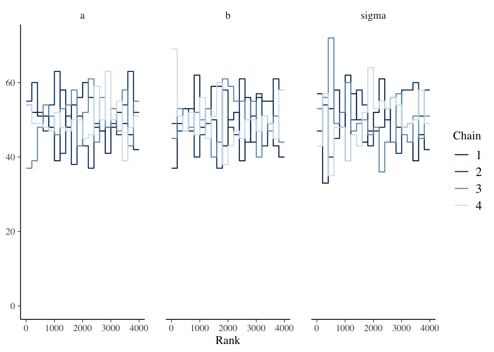

# rethinking {#rethinking}

## Resources

- [Statistical Rethinking](https://xcelab.net/rm/statistical-rethinking/) by McElreath

- [Statistical Rethinking Lectures on YouTube](https://www.youtube.com/channel/UCNJK6_DZvcMqNSzQdEkzvzA/featured)

- [rethinking github repo](https://github.com/rmcelreath/rethinking)

## Description

_Statistical Rethinking_ was one of the first books I read on Bayesian methods, and I highly recommend it. McElreath uses a lot of practical examples which I found very helpful. All of the problems in the book are done with the `rethinking` package which uses the familiar formula syntax for defining models. However, unlike `rstanarm` the functions are not close mirrors of familiar frequentist functions. Another difference from `rstanarm` is you must specify all priors--there are no defaults. 

The `rethinking` package has some nice extras. One is the `stancode` function which returns the `stan` code generated for the model.  This is a great way to start getting familiar with `stan` syntax! Second `map2stan` returns an object that contains a `stanfit` object which you can access with the `@stanfit` accessor.  Most of the `bayesplot` and `shinystan` functions work with that `stanfit` object. Alternatively, the `rethinking` package includes its own functions that work directly on the returned `map2stan` object (see the book for details).

I ran into some difficulty with the semi-parametric regression (\@ref(GAM)), but aside from that the _rethinking_ package is also a very good option for getting started.

## Environment Setup


```r
set.seed(123)
options("scipen" = 1, "digits" = 4)

library(tidyverse)
library(datasets)
data(mtcars)
# mean center disp predictor
mtcars$c_disp = mtcars$disp - mean(mtcars$disp)

library(rethinking)
library(bayesplot)

# Saves compiled version of model so it only has to be recompiled if the model is changed
rstan_options(auto_write = TRUE)
# Set number of cores
options(mc.cores = parallel::detectCores())
```

## Linear Model

### Define Model

The `rethinking` package does not have default priors so I need to explicitly choose them.  Again I'll use the following model:

\begin{align*}
  mpg &\sim Normal(\mu, \sigma^2) \\
  \mu &= a + b*c\_disp \\
  a &\sim Normal(13.2, 5.3^2) \\
  b &\sim Normal(-0.1, 0.05^2) \\
  \sigma &\sim Exponential(1)
\end{align*}


```r
# Note the sign change for mu and b, this seems to be a quirk
# of map2stan that it didn't like b ~ dnorm(-0.1, 0.05)
f <- alist(
  mpg ~ dnorm(mu, sigma),
  mu <- a - b * c_disp,
  a ~ dnorm(13.2, 5.3),
  b ~ dnorm(0.1, 0.05),
  sigma ~ dexp(1)
)

# Note the default number of chains = 1, so I'm explicitly setting to available cores
mdl1 <- map2stan(f,mtcars, chains=parallel::detectCores())
```

The automatically generated `stan` code:


```r
stancode(mdl1)
```

```
## //2020-12-29 20:26:23
## data{
##     int<lower=1> N;
##     real mpg[N];
##     real c_disp[N];
## }
## parameters{
##     real a;
##     real b;
##     real<lower=0> sigma;
## }
## model{
##     vector[N] mu;
##     sigma ~ exponential( 1 );
##     b ~ normal( 0.1 , 0.05 );
##     a ~ normal( 13.2 , 5.3 );
##     for ( i in 1:N ) {
##         mu[i] = a - b * c_disp[i];
##     }
##     mpg ~ normal( mu , sigma );
## }
## generated quantities{
##     vector[N] mu;
##     for ( i in 1:N ) {
##         mu[i] = a - b * c_disp[i];
##     }
## }
```

### Prior Predictive Distribution {#rethinkingprior}


```r
# Plot prior predictive distribution
N <- 50

prior_samples <- as.data.frame(extract.prior(mdl1, n=N))

D <- seq(min(mtcars$c_disp), max(mtcars$c_disp), length.out = N)

res <- as.data.frame(apply(prior_samples, 1, function(x) x[1] - x[2] * (D))) %>%
  mutate(c_disp = D) %>%
  pivot_longer(cols=c(-"c_disp"), names_to="iter") 

res %>%
  ggplot() +
  geom_line(aes(x=c_disp, y=value, group=iter), alpha=0.2) +
  labs(x="disp", y="prior predictive mpg")
```


### Diagnostics


```r
mcmc_trace(mdl1@stanfit, pars=c("a", "b", "sigma"))
```


```r
mcmc_rank_overlay(mdl1@stanfit, pars=c("a", "b", "sigma"))
```



The `precis` function displays `n_eff` and $\widehat{R}$.


```r
precis(mdl1, prob=0.95)
```

```
##           mean       sd     2.5%    97.5% n_eff  Rhat4
## a     20.01656 0.560896 18.90335 21.12146  3632 0.9997
## b      0.04187 0.004546  0.03313  0.05089  4100 1.0005
## sigma  3.21625 0.403185  2.54299  4.10568  3085 1.0017
```

### Posterior Distribution

The `precis` function above also displays both the posterior point estimate and credible interval.

### Posterior Predictive Distribution

Finally, I'll check the posterior predictive distribution. The `rethinking` package includes the `postcheck` function which displays a plot for posterior predictive checking.


```r
postcheck(mdl1, window=nrow(mtcars))
```


Personally, I find the `postcheck` plot hard to use because I can never remember what the different symbols represent.  I prefer the density overlay plot as shown below.


```r
ppc_dens_overlay(mtcars$mpg, sim(mdl1, n=50))
```

```
## [ 5 / 50 ]
[ 10 / 50 ]
[ 15 / 50 ]
[ 20 / 50 ]
[ 25 / 50 ]
[ 30 / 50 ]
[ 35 / 50 ]
[ 40 / 50 ]
[ 45 / 50 ]
[ 50 / 50 ]
```


And the expectation of the posterior predictive distribution (i.e., $\mu$) like I did with `rstanarm` can be generated via the `link` function.


```r
newdata <- data.frame(c_disp=seq(min(mtcars$c_disp), max(mtcars$c_disp)))

y_rep <- as.data.frame(t(link(mdl1, data=newdata, n=50))) %>%
  cbind(newdata) %>%
  pivot_longer(-c_disp, names_to="draw", values_to="mpg")

y_rep %>%
  ggplot(aes(x=c_disp, y=mpg)) +
  geom_line(aes(group=draw), alpha=0.2) +
  geom_point(data = mtcars) 
```


## Semi-parametric Model {#GAM}

### Define Model

Setting up the semi-parametric model is a bit more work in the `rethinking` package.  First, I explicitly create the splines.  The component splines are plotted below.


```r
library(splines)

num_knots <- 4  # number of interior knots
knot_list <- quantile(mtcars$c_disp, probs=seq(0,1,length.out = num_knots))
B <- bs(mtcars$c_disp, knots=knot_list[-c(1,num_knots)], intercept=TRUE)

df1 <- cbind(c_disp=mtcars$c_disp, B) %>%
  as.data.frame() %>%
  pivot_longer(-c_disp, names_to="spline", values_to="val")

# Plot at smaller intervals so curves are smooth
N<- 50
D <- seq(min(mtcars$c_disp), max(mtcars$c_disp), length.out = N)
B_plot <- bs(D, 
             knots=knot_list[-c(1,num_knots)], 
             intercept=TRUE)

df2 <- cbind(c_disp=D, B_plot) %>%
  as.data.frame() %>%
  pivot_longer(-c_disp, names_to="spline", values_to="val")

ggplot(mapping=aes(x=c_disp, y=val, color=spline)) +
  geom_point(data=df1) +
  geom_line(data=df2, linetype="dashed")
```


Note: the dashed lines are the splines and the points are the values of the spline at the specific values of `mtcars$c_disp`; the points are inputs into the `rethinking` model.

Then I define the model with the splines.  I wasn't able to get this model to work with either the `map2stan` or `ulam` functions, so I used `quap` instead which fits a quadratic approximation.


```r
f <- alist(
  mpg ~ dnorm(mu, sigma),
  mu <- a - B %*% w,
  a ~ dnorm(25, 10),
  w ~ dnorm(0,5),
  sigma ~ dexp(1)
)

mdl2 <- quap(f, data=list(mpg=mtcars$mpg, B=B),
             start=list(w=rep(1, ncol(B)))
            )
```

### Diagnostics

Since MCMC was not used to fit the model, there are no chain diagnostics to examine. 

### Posterior Distribution

I can still use the `precis` function to look at the posterior distribution, although there's really no intuitive interpretation for the spline weights.


```r
precis(mdl2, depth=2)
```

```
##           mean     sd    5.5%   94.5%
## w[1]  -12.0857 2.2957 -15.755 -8.4166
## w[2]   -4.3134 2.5531  -8.394 -0.2331
## w[3]    0.4939 2.7405  -3.886  4.8738
## w[4]    5.9012 2.8873   1.287 10.5157
## w[5]    2.1850 2.8839  -2.424  6.7940
## w[6]    9.0626 2.3915   5.241 12.8846
## a      20.2067 2.0329  16.958 23.4556
## sigma   1.9637 0.2397   1.581  2.3468
```

### Posterior Predictive Distribution

Finally, the posterior predictive distribution and LOESS for comparison:


```r
mu <- link(mdl2)
mu_mean <- as.data.frame(apply(mu, 2, mean)) %>%
  mutate(c_disp=mtcars$c_disp)
colnames(mu_mean) <- c("mpg_ppd", "c_disp")

mu_PI <- as.data.frame(t(apply(mu,2,PI,0.95))) %>%
  mutate(c_disp=mtcars$c_disp)
colnames(mu_PI) <- c("lwr", "upr", "c_disp")

ggplot() +
  geom_point(data=mtcars, aes(x=c_disp, y=mpg)) +
  geom_line(data=mu_mean, aes(x=c_disp, y=mpg_ppd), color="blue") +
  geom_ribbon(data=mu_PI, aes(x=c_disp, ymin=lwr, ymax=upr), alpha=0.2) +
  labs(title="GAM")

ggplot(mapping=aes(x=c_disp, y=mpg-mean(mpg)),
              data=mtcars) +
  geom_point()+
  stat_smooth(method="loess",
              level=0.95) +
  labs(title="LOESS")
```


## Session Info


```r
sessionInfo()
```

```
## R version 4.0.3 (2020-10-10)
## Platform: x86_64-apple-darwin17.0 (64-bit)
## Running under: macOS Big Sur 10.16
## 
## Matrix products: default
## BLAS:   /Library/Frameworks/R.framework/Versions/4.0/Resources/lib/libRblas.dylib
## LAPACK: /Library/Frameworks/R.framework/Versions/4.0/Resources/lib/libRlapack.dylib
## 
## locale:
## [1] en_US.UTF-8/en_US.UTF-8/en_US.UTF-8/C/en_US.UTF-8/en_US.UTF-8
## 
## attached base packages:
## [1] splines   parallel  stats     graphics  grDevices datasets  utils    
## [8] methods   base     
## 
## other attached packages:
##  [1] bayesplot_1.7.2      rethinking_2.13      rstan_2.21.2        
##  [4] StanHeaders_2.21.0-6 forcats_0.5.0        stringr_1.4.0       
##  [7] dplyr_1.0.2          purrr_0.3.4          readr_1.4.0         
## [10] tidyr_1.1.2          tibble_3.0.4         ggplot2_3.3.2       
## [13] tidyverse_1.3.0     
## 
## loaded via a namespace (and not attached):
##  [1] nlme_3.1-149       matrixStats_0.57.0 fs_1.5.0           lubridate_1.7.9.2 
##  [5] httr_1.4.2         tools_4.0.3        backports_1.2.0    R6_2.5.0          
##  [9] mgcv_1.8-33        DBI_1.1.0          colorspace_2.0-0   withr_2.3.0       
## [13] tidyselect_1.1.0   gridExtra_2.3      prettyunits_1.1.1  processx_3.4.5    
## [17] curl_4.3           compiler_4.0.3     cli_2.2.0          rvest_0.3.6       
## [21] xml2_1.3.2         labeling_0.4.2     bookdown_0.21      scales_1.1.1      
## [25] mvtnorm_1.1-1      ggridges_0.5.2     callr_3.5.1        digest_0.6.27     
## [29] rmarkdown_2.5      pkgconfig_2.0.3    htmltools_0.5.0    dbplyr_2.0.0      
## [33] rlang_0.4.9        readxl_1.3.1       rstudioapi_0.13    shape_1.4.5       
## [37] generics_0.1.0     farver_2.0.3       jsonlite_1.7.1     inline_0.3.17     
## [41] magrittr_2.0.1     loo_2.3.1          Matrix_1.2-18      Rcpp_1.0.5        
## [45] munsell_0.5.0      fansi_0.4.1        lifecycle_0.2.0    stringi_1.5.3     
## [49] yaml_2.2.1         MASS_7.3-53        pkgbuild_1.1.0     plyr_1.8.6        
## [53] grid_4.0.3         crayon_1.3.4       lattice_0.20-41    haven_2.3.1       
## [57] hms_0.5.3          knitr_1.30         ps_1.4.0           pillar_1.4.7      
## [61] reshape2_1.4.4     codetools_0.2-16   stats4_4.0.3       reprex_0.3.0      
## [65] glue_1.4.2         evaluate_0.14      V8_3.4.0           renv_0.12.0       
## [69] RcppParallel_5.0.2 modelr_0.1.8       vctrs_0.3.5        cellranger_1.1.0  
## [73] gtable_0.3.0       assertthat_0.2.1   xfun_0.19          broom_0.7.2       
## [77] coda_0.19-4        ellipsis_0.3.1
```


