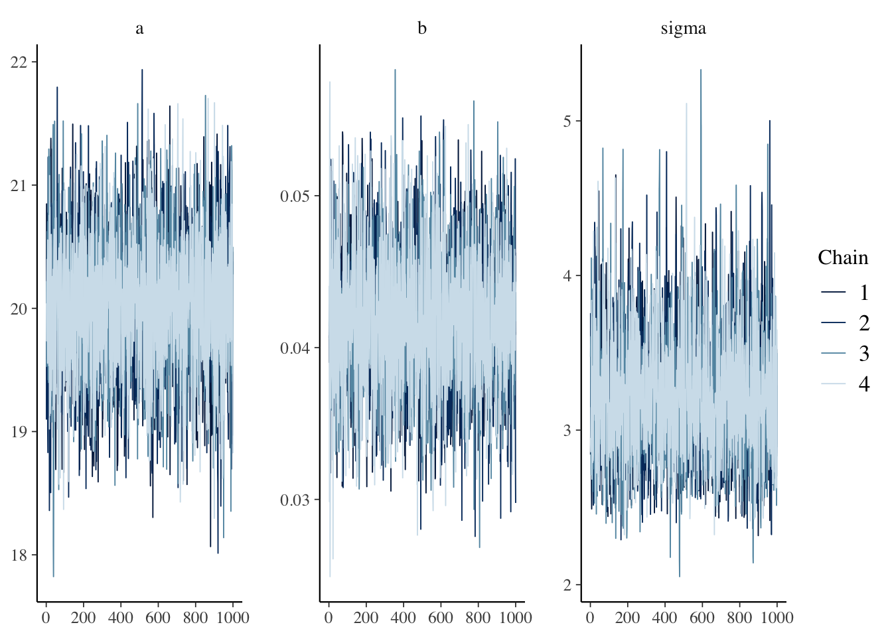
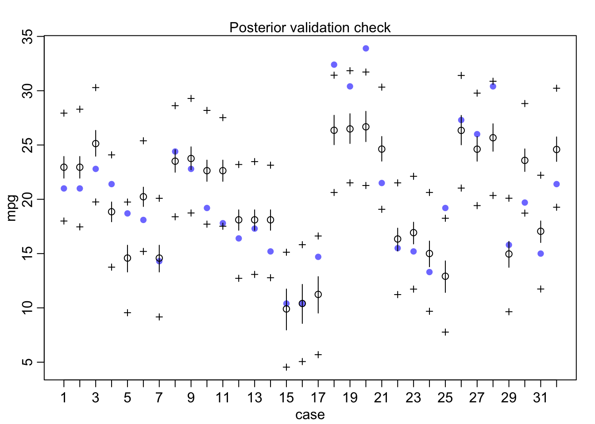
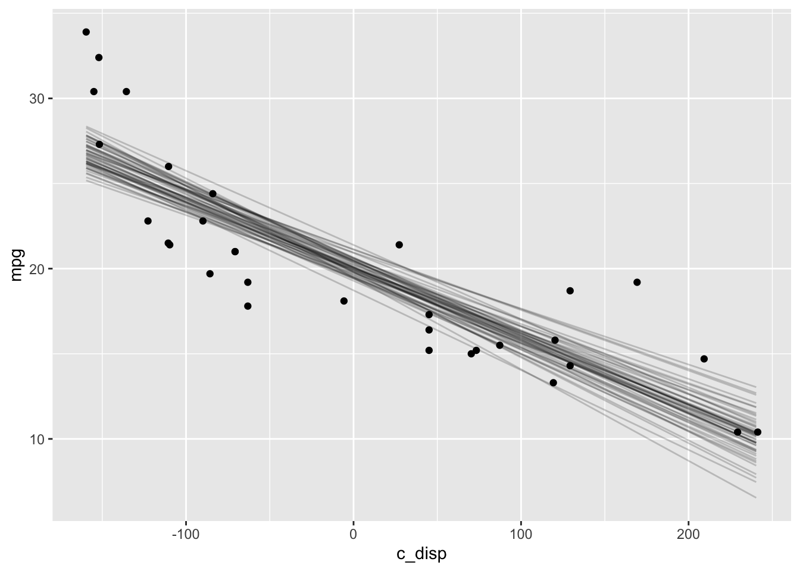

# rethinking {#rethinking}

## Resources

- [Statistical Rethinking](https://xcelab.net/rm/statistical-rethinking/) by McElreath

- [Statistical Rethinking Lectures on YouTube](https://www.youtube.com/channel/UCNJK6_DZvcMqNSzQdEkzvzA/featured)

- [rethinking github repo](https://github.com/rmcelreath/rethinking)

## Description

_Statistical Rethinking_ was the first book I read on Bayesian methods, and I highly recommend it. All of the problems in the book are done with the `rethinking` package. It uses the familiar formula syntax for defining models. However, unlike `rstanarm` the functions are not close mirrors of familiar frequentist functions. Another difference from `rstanarm` is you must specify all priors--there are no defaults. I ran into some difficulty with the semi-parametric regression (\@ref(GAM)), but aside from that it's also a very good option for getting started.

## Environment Setup


```r
rm(list=ls())

set.seed(123)
options("scipen" = 1, "digits" = 4)

library(tidyverse)
library(datasets)
data(mtcars)

library(rethinking)
```

## Linear Model

### Define Model

The `rethinking` package does not have default priors so I need to explicitly choose them.  Again I'll use the follmodel is

\begin{align*}
  mpg &\sim N(\mu, \sigma^2) \\
  \mu &= a + b*disp \\
  a &\sim Normal(25,10^2) \\
  b &\sim Normal(-0.2, 0.1^2) \\
  \sigma &\sim Exponential(1)
\end{align*}


```r
# Note the sign change for mu and b, this seems to be a quirk
# of map2stan that it didn't like b ~ dnorm(-0.2, 0.1)
f <- alist(
  mpg ~ dnorm(mu, sigma),
  mu <- a - b * disp,
  a ~ dnorm(25, 10),
  b ~ dnorm(0.2, 0.1),
  sigma ~ dexp(1)
)

# Note the default number of chains = 1, so I'm explicitly setting to 4 here
mdl1 <- map2stan(f,mtcars, chains=4)
```

```
## Trying to compile a simple C file
```

```
## Computing WAIC
```

### Prior Predictive Distribution {#rethinkingprior}


```r
# Plot prior predictive distribution
N <- 100

prior_samples <- as.data.frame(extract.prior(mdl1, n=N))

D <- seq(min(mtcars$disp), max(mtcars$disp), length.out = N)

res <- as.data.frame(apply(prior_samples, 1, function(x) x[1] - x[2] * (D-mean(mtcars$disp)))) %>%
  mutate(disp = D) %>%
  pivot_longer(cols=c(-"disp"), names_to="iter") 

res %>%
  ggplot() +
  geom_line(aes(x=disp, y=value, group=iter), alpha=0.2) +
  labs(x="disp", y="prior predictive mpg")
```


### Diagnostics

The `traceplot` function is the `rethinking` equivalent to `mcmc_trace`.


```r
traceplot(mdl1@stanfit)
```



The `trankplot` function is the `rethinking` equivalent to the `mcmc_rank_overlay`.  


```r
trankplot(mdl1)
```


The `trankplot` function conveniently also displays the effective sample size (`n_eff`).  But the `precis` function is another way to get both `n_eff` and $\widehat{R}$.


```r
precis(mdl1, prob=0.95)
```

```
##           mean      sd     2.5%    97.5% n_eff Rhat4
## a     29.65030 1.18866 27.32351 32.02460  1429 1.000
## b      0.04148 0.00448  0.03252  0.05042  1472 1.000
## sigma  3.20829 0.40702  2.51923  4.07572  1673 1.003
```

### Posterior Distribution

The `precis` function above also displays both the posterior point estimate and credible interval.

### Posterior Predictive Distribution

Finally, I'll check the posterior predictive distribution. The `rethinking` package includes the `postcheck` function which displays a plot for posterior predictive checking.


```r
postcheck(mdl1, window=nrow(mtcars))
```



Alternatively, I can plot the expectation of the posterior predictive distribution (i.e., $\mu$) like I did with `rstanarm` . The `sim` function draws samples from the posterior predictive distribution, and the `link` function returns the linear predictor, possibly transformed by the inverse-link function. In this case, the model is a Gaussian likelihood with an identity link function, so the `sim` and `link` functions return identical results.


```r
newdata <- data.frame(disp=seq(min(mtcars$disp), max(mtcars$disp)))

y_rep <- as.data.frame(t(link(mdl1, data=newdata, n=50))) %>%
  cbind(newdata) %>%
  pivot_longer(cols=starts_with("V"), names_to="grp", values_to="mpg")

y_rep %>%
  ggplot(aes(x=disp, y=mpg)) +
  geom_line(aes(group=grp), alpha=0.2) +
  geom_point(data = mtcars) 
```



## Semi-parametric Model {#GAM}

### Define Model

Setting up the semi-parametric model is a bit more work in the `rethinking` package.  First, I explicitly create the splines.  The component splines are plotted below.


```r
library(splines)

num_knots <- 4  # number of interior knots
knot_list <- quantile(mtcars$disp, probs=seq(0,1,length.out = num_knots))
B <- bs(mtcars$disp, knots=knot_list[-c(1,num_knots)], intercept=TRUE)

df1 <- cbind(disp=mtcars$disp, B) %>%
  as.data.frame() %>%
  pivot_longer(-disp, names_to="spline", values_to="val")

# Plot at smaller intervals so curves are smooth
N<- 50
D <- seq(min(mtcars$disp), max(mtcars$disp), length.out = N)
B_plot <- bs(D, 
             knots=knot_list[-c(1,num_knots)], 
             intercept=TRUE)

df2 <- cbind(disp=D, B_plot) %>%
  as.data.frame() %>%
  pivot_longer(-disp, names_to="spline", values_to="val")

ggplot(mapping=aes(x=disp, y=val, color=spline)) +
  geom_point(data=df1) +
  geom_line(data=df2, linetype="dashed")
```


Then I define the model with the splines.  I wasn't able to get this model to work with either the `map2stan` or `ulam` functions, so I used `quap` instead which fits a quadratic approximation.


```r
f <- alist(
  mpg ~ dnorm(mu, sigma),
  mu <- a - B %*% w,
  a ~ dnorm(25, 10),
  w ~ dnorm(0,5),
  sigma ~ dexp(1)
)


mdl2 <- quap(f, data=list(mpg=mtcars$mpg, B=B),
             start=list(w=rep(1, ncol(B)))
            )
```

### Prior Predictive Distribution

### Diagnostics

Since MCMC was not used to fit the model, there are no chain diagnostics to examine. 

### Posterior Distribution

I can still use the `precis` function to look at the postrior distribution, although there's really no intuitive interpretation for the spline weights.


```r
precis(mdl2, depth=2)
```

```
##           mean     sd    5.5%   94.5%
## w[1]  -12.0932 2.2958 -15.762 -8.4241
## w[2]   -4.3203 2.5531  -8.401 -0.2399
## w[3]    0.4861 2.7405  -3.894  4.8660
## w[4]    5.8948 2.8873   1.280 10.5093
## w[5]    2.1765 2.8839  -2.433  6.7856
## w[6]    9.0562 2.3915   5.234 12.8782
## a      20.1995 2.0329  16.951 23.4484
## sigma   1.9638 0.2397   1.581  2.3469
```

### Posterior Predictive Distribution

Finally, the posterior predictive distribution and LOESS for comparison:


```r
mu <- link(mdl2)
mu_mean <- as.data.frame(apply(mu, 2, mean)) %>%
  mutate(disp=mtcars$disp)
colnames(mu_mean) <- c("mpg_ppd", "disp")

mu_PI <- as.data.frame(t(apply(mu,2,PI,0.95))) %>%
  mutate(disp=mtcars$disp)
colnames(mu_PI) <- c("lwr", "upr", "disp")

ggplot() +
  geom_point(data=mtcars, aes(x=disp, y=mpg)) +
  geom_line(data=mu_mean, aes(x=disp, y=mpg_ppd), color="blue") +
  geom_ribbon(data=mu_PI, aes(x=disp, ymin=lwr, ymax=upr), alpha=0.2) +
  labs(title="GAM")

ggplot(mapping=aes(x=disp, y=mpg-mean(mpg)),
              data=mtcars) +
  geom_point()+
  stat_smooth(method="loess",
              level=0.95) +
  labs(title="LOESS")
```


## Extras

The `rethinking` package has some nice extras. One is the `stancode` function will return the `stan` code generated for the model.  This is a great way to start getting familiar with `stan` syntax!


```r
stancode(mdl1)
```

```
## //2020-12-08 18:53:07
## data{
##     int<lower=1> N;
##     real mpg[N];
##     real disp[N];
## }
## parameters{
##     real a;
##     real b;
##     real<lower=0> sigma;
## }
## model{
##     vector[N] mu;
##     sigma ~ exponential( 1 );
##     b ~ normal( 0.2 , 0.1 );
##     a ~ normal( 25 , 10 );
##     for ( i in 1:N ) {
##         mu[i] = a - b * disp[i];
##     }
##     mpg ~ normal( mu , sigma );
## }
## generated quantities{
##     vector[N] mu;
##     for ( i in 1:N ) {
##         mu[i] = a - b * disp[i];
##     }
## }
```

Also, `map2stan` returns an object that contains a `stanfit` object which you can access with the `\@stanfit` accessor.  Both `bayesplot` and `shinystan` work with that `stanfit` object just like they do with `rstanarm` or `rstan` models.

## Session Info


```r
sessionInfo()
```

```
## R version 4.0.3 (2020-10-10)
## Platform: x86_64-apple-darwin17.0 (64-bit)
## Running under: macOS Big Sur 10.16
## 
## Matrix products: default
## BLAS:   /Library/Frameworks/R.framework/Versions/4.0/Resources/lib/libRblas.dylib
## LAPACK: /Library/Frameworks/R.framework/Versions/4.0/Resources/lib/libRlapack.dylib
## 
## locale:
## [1] en_US.UTF-8/en_US.UTF-8/en_US.UTF-8/C/en_US.UTF-8/en_US.UTF-8
## 
## attached base packages:
## [1] splines   parallel  stats     graphics  grDevices datasets  utils    
## [8] methods   base     
## 
## other attached packages:
##  [1] rethinking_2.13      rstan_2.21.2         StanHeaders_2.21.0-6
##  [4] forcats_0.5.0        stringr_1.4.0        dplyr_1.0.2         
##  [7] purrr_0.3.4          readr_1.4.0          tidyr_1.1.2         
## [10] tibble_3.0.4         ggplot2_3.3.2        tidyverse_1.3.0     
## 
## loaded via a namespace (and not attached):
##  [1] httr_1.4.2         jsonlite_1.7.1     modelr_0.1.8       RcppParallel_5.0.2
##  [5] assertthat_0.2.1   stats4_4.0.3       renv_0.12.0        cellranger_1.1.0  
##  [9] yaml_2.2.1         pillar_1.4.7       backports_1.2.0    lattice_0.20-41   
## [13] glue_1.4.2         digest_0.6.27      rvest_0.3.6        colorspace_2.0-0  
## [17] Matrix_1.2-18      htmltools_0.5.0    pkgconfig_2.0.3    broom_0.7.2       
## [21] haven_2.3.1        bookdown_0.21      mvtnorm_1.1-1      scales_1.1.1      
## [25] processx_3.4.5     mgcv_1.8-33        farver_2.0.3       generics_0.1.0    
## [29] ellipsis_0.3.1     withr_2.3.0        cli_2.2.0          magrittr_2.0.1    
## [33] crayon_1.3.4       readxl_1.3.1       evaluate_0.14      ps_1.4.0          
## [37] fs_1.5.0           fansi_0.4.1        nlme_3.1-149       MASS_7.3-53       
## [41] xml2_1.3.2         pkgbuild_1.1.0     tools_4.0.3        loo_2.3.1         
## [45] prettyunits_1.1.1  hms_0.5.3          lifecycle_0.2.0    matrixStats_0.57.0
## [49] V8_3.4.0           munsell_0.5.0      reprex_0.3.0       callr_3.5.1       
## [53] compiler_4.0.3     rlang_0.4.9        grid_4.0.3         rstudioapi_0.13   
## [57] labeling_0.4.2     rmarkdown_2.5      gtable_0.3.0       codetools_0.2-16  
## [61] inline_0.3.17      DBI_1.1.0          curl_4.3           R6_2.5.0          
## [65] gridExtra_2.3      lubridate_1.7.9.2  knitr_1.30         shape_1.4.5       
## [69] stringi_1.5.3      Rcpp_1.0.5         vctrs_0.3.5        dbplyr_2.0.0      
## [73] tidyselect_1.1.0   xfun_0.19          coda_0.19-4
```


