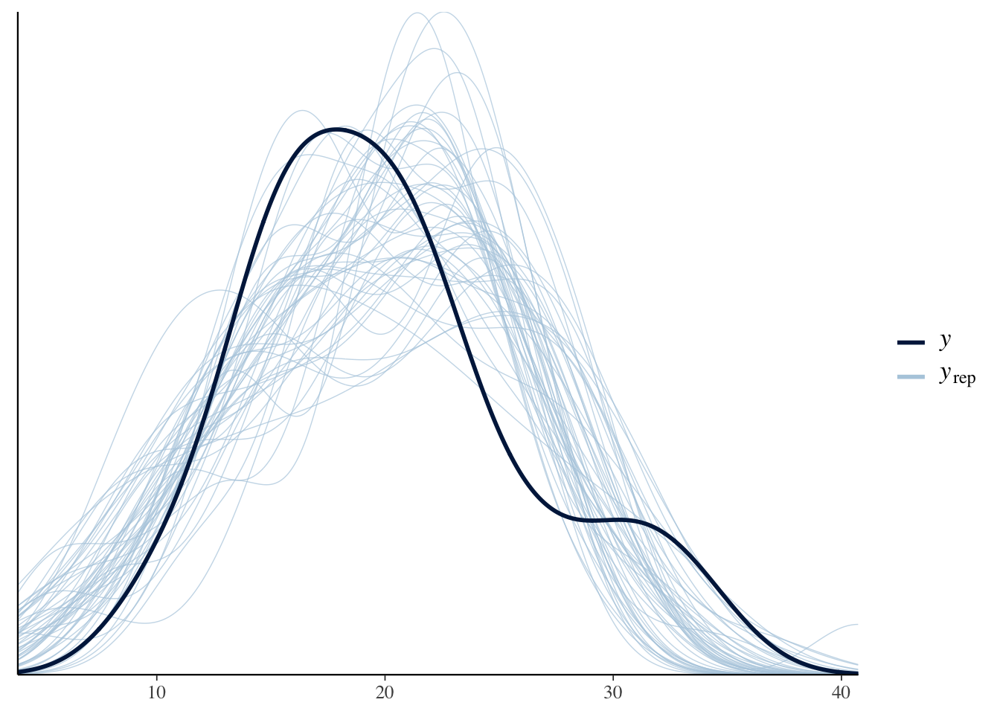

# brms {#brms}

## Resources

- [Overview of brms](https://cran.r-project.org/web/packages/brms/vignettes/brms_overview.pdf)

- [Solomon Kurz's translation of _Statistical Rethinking_](https://bookdown.org/content/4857/)

## Description

For those familiar with the `lme4` package, `brms` is a natural transition because it uses a similar syntax for specifying multi-level models. `brms` capabilities overlap in some areas with both `rstanarm` and `rethinking` while providing expanded features in other areas. For example, `brms` supports default priors (although not the same weakly informative priors as `rstanarm`) while also allowing great flexibility for user-defined priors (like `rethinking`). The `brmsfit` object is compatible with both the `bayesplot` and `shinystan` packages. Like `rethinking`, there is a method for extracting the automatically generated `stan` code. These are just a few of the similarities and differences; the overview document linked above includes a table with a complete comparison of the three packages.

## Environment Setup


```r
set.seed(123)
options("scipen" = 1, "digits" = 4)
knitr::opts_chunk$set(message=FALSE)

library(tidyverse)
library(datasets)
data(mtcars)
# mean center disp predictor
mtcars$c_disp = mtcars$disp - mean(mtcars$disp)

library(brms)
library(bayesplot)

# Set number of cores
options(mc.cores = parallel::detectCores())
```

## Linear Model

### Define Model

The `brms` package default priors are improper flat priors over the real line. However, there is a strong case to be made against this type of non-informative prior ^[https://mc-stan.org/users/documentation/case-studies/weakly_informative_shapes.html]. So I'll proceed directly to the priors based on the EPA data.

\begin{align*}
  mpg &\sim Normal(\mu, \sigma^2) \\
  \mu &= a + b*c\_disp \\
  a &\sim Normal(13.2, 5.3^2) \\
  b &\sim Normal(-0.1, 0.05^2) \\
  \sigma &\sim Exponential(1)
\end{align*}


```r
mdl1 <- brm(mpg ~ c_disp, data=mtcars, family=gaussian(), 
            prior=c(set_prior("normal(-0.1, 0.05)", class="b", coef = "c_disp"),
                    set_prior("normal(13.2, 5.3)", class="Intercept"),
                    set_prior("exponential(1)", class="sigma")))
```

Like the `rethinking` package, `brms` also implements the `stancode` function.  This `stan` model looks more complicated, but it is functionally equivalent to the `rethinking` model.


```r
stancode(mdl1)
```

```
## // generated with brms 2.14.4
## functions {
## }
## data {
##   int<lower=1> N;  // total number of observations
##   vector[N] Y;  // response variable
##   int<lower=1> K;  // number of population-level effects
##   matrix[N, K] X;  // population-level design matrix
##   int prior_only;  // should the likelihood be ignored?
## }
## transformed data {
##   int Kc = K - 1;
##   matrix[N, Kc] Xc;  // centered version of X without an intercept
##   vector[Kc] means_X;  // column means of X before centering
##   for (i in 2:K) {
##     means_X[i - 1] = mean(X[, i]);
##     Xc[, i - 1] = X[, i] - means_X[i - 1];
##   }
## }
## parameters {
##   vector[Kc] b;  // population-level effects
##   real Intercept;  // temporary intercept for centered predictors
##   real<lower=0> sigma;  // residual SD
## }
## transformed parameters {
## }
## model {
##   // likelihood including all constants
##   if (!prior_only) {
##     target += normal_id_glm_lpdf(Y | Xc, Intercept, b, sigma);
##   }
##   // priors including all constants
##   target += normal_lpdf(b[1] | -0.1, 0.05);
##   target += normal_lpdf(Intercept | 13.2, 5.3);
##   target += exponential_lpdf(sigma | 1);
## }
## generated quantities {
##   // actual population-level intercept
##   real b_Intercept = Intercept - dot_product(means_X, b);
## }
```


### Prior Predictive Distribution

There are several methods for getting the prior predictive distribution from the `brms` model.

1. The `prior_summary` function displays model priors. Manually draw samples from those distributions and then construct the prior predictive distribution as I did in \@ref(rethinkingprior). 
    
2. In the `brm` function, set the parameter `sample_prior="yes"`.  Then use the function 'prior_samples` to get samples from the prior distributions and construct the prior predictive distribution.
    
3. Sample from the model _without_ conditioning on the data.  We do that by setting the parameter `sample_prior = "only"` and then using the `predict` and `posterior_epred` functions to draw samples from the prior only model.
    
Method 3 is demonstrated below.


```r
D <- seq(min(mtcars$c_disp), max(mtcars$c_disp))

mdl1_prior <- update(mdl1, sample_prior="only")

# Summarizes samples from posterior predictive distribution
ppd <- as.data.frame(predict(mdl1_prior, newdata=data.frame(c_disp=D)))
# Samples from expected value of posterior predictive distribution
eppd <- posterior_epred(mdl1_prior, newdata=data.frame(c_disp=D), 
                        summary=FALSE, nsamples=50) %>%
  t() %>%
  as.data.frame() %>%
  mutate(c_disp=D) %>%
  pivot_longer(-c_disp, names_to="iter", values_to="mpg")


ggplot() +
  geom_ribbon(data=ppd, mapping=aes(x=D, ymin=Q2.5, ymax=Q97.5), alpha=0.5, fill="lightblue") +
  geom_line(data=eppd, mapping=aes(x=c_disp, y=mpg, group=iter), alpha=0.2) 
```


### Diagnostics


```r
mcmc_rank_overlay(mdl1, pars=c("b_Intercept", "b_c_disp", "sigma"))
```


```r
summary(mdl1)
```

```
##  Family: gaussian 
##   Links: mu = identity; sigma = identity 
## Formula: mpg ~ c_disp 
##    Data: mtcars (Number of observations: 32) 
## Samples: 4 chains, each with iter = 2000; warmup = 1000; thin = 1;
##          total post-warmup samples = 4000
## 
## Population-Level Effects: 
##           Estimate Est.Error l-95% CI u-95% CI Rhat Bulk_ESS Tail_ESS
## Intercept    19.99      0.56    18.91    21.08 1.00     3307     2869
## c_disp       -0.04      0.00    -0.05    -0.03 1.00     4633     3056
## 
## Family Specific Parameters: 
##       Estimate Est.Error l-95% CI u-95% CI Rhat Bulk_ESS Tail_ESS
## sigma     3.20      0.40     2.53     4.09 1.00     2746     2602
## 
## Samples were drawn using sampling(NUTS). For each parameter, Bulk_ESS
## and Tail_ESS are effective sample size measures, and Rhat is the potential
## scale reduction factor on split chains (at convergence, Rhat = 1).
```

### Posterior Distribution

The simple linear model only has population-level (i.e., "fixed") effects, and the `fixef` function extracts a summary of those parameters only.  Note that this is the same information as returned from the `summary` function above.


```r
fixef(mdl1)
```

```
##           Estimate Est.Error    Q2.5    Q97.5
## Intercept 19.99038  0.557763 18.9132 21.08207
## c_disp    -0.04191  0.004729 -0.0512 -0.03245
```

### Posterior Predictive Distribution

The `brms` package includes the `pp_check` function which uses `bayesplot` under the hood.


```r
pp_check(mdl1, nsamples = 50)
```



Or we can use `ppc_dens_overly` directly with the `brmsfit` object as shown below.


```r
ppc_dens_overlay(mtcars$mpg, posterior_predict(mdl1, nsamples=50))
```


And below is a plot of the expected value of the posterior predictive distribution overlayed with the observations.


```r
D <- seq(min(mtcars$c_disp), max(mtcars$c_disp))

# Samples from expected value of posterior predictive distribution
eppd <- posterior_epred(mdl1, newdata=data.frame(c_disp=D), 
                        nsamples=50, summary=FALSE) %>%
  t() %>%
  as.data.frame() %>%
  mutate(c_disp=D) %>%
  pivot_longer(-c_disp, names_to="iter", values_to="mpg")


ggplot() +
  geom_line(data=eppd, mapping=aes(x=c_disp, y=mpg, group=iter), alpha=0.2) +
  geom_point(data=mtcars, mapping=aes(x=c_disp, y=mpg))
```


## Semi-parametric Model

### Define Model

The semi-parametric model is formulated as a mixed-model ^[http://matt-wand.utsacademics.info/publicns/Wand03.pdf] in `brms`.

We can use the `get_prior` function to check what the default priors are for this mixed model.


```r
get_prior(mpg ~ s(c_disp, bs="cr", k=7), data=mtcars, family=gaussian())
```

```
##                    prior     class                  coef group resp dpar nlpar
##                   (flat)         b                                            
##                   (flat)         b             sc_disp_1                      
##  student_t(3, 19.2, 5.4) Intercept                                            
##     student_t(3, 0, 5.4)       sds                                            
##     student_t(3, 0, 5.4)       sds s(c_disp,bs="cr",k=7)                      
##     student_t(3, 0, 5.4)     sigma                                            
##  bound       source
##             default
##        (vectorized)
##             default
##             default
##        (vectorized)
##             default
```
I'll replace the improper prior for the smoothing parameter fixed effect  and leave the rest since they are weakly informative priors.  See the `set_prior` help for details on changing the priors for the other parameters.


```r
mdl2 <- brm(mpg ~ s(c_disp, bs="cr", k=7), data=mtcars, family=gaussian(), 
            prior=c(set_prior("normal(0,5)", class="b")),
            control=list(adapt_delta=0.99))
```

### Prior Predictive Distribution


```r
mdl2_prior <- update(mdl2, sample_prior="only")

pp_check(mdl2_prior, nsamples = 50)
```


### Diagnostics


```r
summary(mdl2)
```

```
##  Family: gaussian 
##   Links: mu = identity; sigma = identity 
## Formula: mpg ~ s(c_disp, bs = "cr", k = 7) 
##    Data: mtcars (Number of observations: 32) 
## Samples: 4 chains, each with iter = 2000; warmup = 1000; thin = 1;
##          total post-warmup samples = 4000
## 
## Smooth Terms: 
##                Estimate Est.Error l-95% CI u-95% CI Rhat Bulk_ESS Tail_ESS
## sds(sc_disp_1)     1.38      0.86     0.39     3.71 1.00      778     1369
## 
## Population-Level Effects: 
##           Estimate Est.Error l-95% CI u-95% CI Rhat Bulk_ESS Tail_ESS
## Intercept    20.08      0.43    19.19    20.93 1.00     3567     2408
## sc_disp_1    -3.18      0.28    -3.72    -2.63 1.00     3009     2652
## 
## Family Specific Parameters: 
##       Estimate Est.Error l-95% CI u-95% CI Rhat Bulk_ESS Tail_ESS
## sigma     2.40      0.35     1.83     3.19 1.00     2433     2652
## 
## Samples were drawn using sampling(NUTS). For each parameter, Bulk_ESS
## and Tail_ESS are effective sample size measures, and Rhat is the potential
## scale reduction factor on split chains (at convergence, Rhat = 1).
```


```r
pp_check(mdl2, nsamples=50)
```


### Posterior Distribution

The summary


### Posterior Predictive Distribution


```r
plot(conditional_effects(mdl2), points=TRUE) 
```


## Session Info


```r
sessionInfo()
```

```
## R version 4.0.3 (2020-10-10)
## Platform: x86_64-apple-darwin17.0 (64-bit)
## Running under: macOS Big Sur 10.16
## 
## Matrix products: default
## BLAS:   /Library/Frameworks/R.framework/Versions/4.0/Resources/lib/libRblas.dylib
## LAPACK: /Library/Frameworks/R.framework/Versions/4.0/Resources/lib/libRlapack.dylib
## 
## locale:
## [1] en_US.UTF-8/en_US.UTF-8/en_US.UTF-8/C/en_US.UTF-8/en_US.UTF-8
## 
## attached base packages:
## [1] stats     graphics  grDevices datasets  utils     methods   base     
## 
## other attached packages:
##  [1] bayesplot_1.7.2 brms_2.14.4     Rcpp_1.0.5      forcats_0.5.0  
##  [5] stringr_1.4.0   dplyr_1.0.2     purrr_0.3.4     readr_1.4.0    
##  [9] tidyr_1.1.2     tibble_3.0.4    ggplot2_3.3.2   tidyverse_1.3.0
## 
## loaded via a namespace (and not attached):
##   [1] minqa_1.2.4          colorspace_2.0-0     ellipsis_0.3.1      
##   [4] ggridges_0.5.2       rsconnect_0.8.16     markdown_1.1        
##   [7] base64enc_0.1-3      fs_1.5.0             rstudioapi_0.13     
##  [10] farver_2.0.3         rstan_2.21.2         DT_0.16             
##  [13] fansi_0.4.1          mvtnorm_1.1-1        lubridate_1.7.9.2   
##  [16] xml2_1.3.2           codetools_0.2-16     bridgesampling_1.0-0
##  [19] splines_4.0.3        knitr_1.30           shinythemes_1.1.2   
##  [22] projpred_2.0.2       jsonlite_1.7.1       nloptr_1.2.2.2      
##  [25] broom_0.7.2          dbplyr_2.0.0         shiny_1.5.0         
##  [28] compiler_4.0.3       httr_1.4.2           backports_1.2.0     
##  [31] assertthat_0.2.1     Matrix_1.2-18        fastmap_1.0.1       
##  [34] cli_2.2.0            later_1.1.0.1        prettyunits_1.1.1   
##  [37] htmltools_0.5.0      tools_4.0.3          igraph_1.2.6        
##  [40] coda_0.19-4          gtable_0.3.0         glue_1.4.2          
##  [43] reshape2_1.4.4       V8_3.4.0             cellranger_1.1.0    
##  [46] vctrs_0.3.5          nlme_3.1-149         crosstalk_1.1.0.1   
##  [49] xfun_0.19            ps_1.4.0             lme4_1.1-26         
##  [52] rvest_0.3.6          mime_0.9             miniUI_0.1.1.1      
##  [55] lifecycle_0.2.0      renv_0.12.0          gtools_3.8.2        
##  [58] statmod_1.4.35       MASS_7.3-53          zoo_1.8-8           
##  [61] scales_1.1.1         colourpicker_1.1.0   hms_0.5.3           
##  [64] promises_1.1.1       Brobdingnag_1.2-6    parallel_4.0.3      
##  [67] inline_0.3.17        shinystan_2.5.0      curl_4.3            
##  [70] gamm4_0.2-6          yaml_2.2.1           gridExtra_2.3       
##  [73] StanHeaders_2.21.0-6 loo_2.3.1            stringi_1.5.3       
##  [76] dygraphs_1.1.1.6     pkgbuild_1.1.0       boot_1.3-25         
##  [79] rlang_0.4.9          pkgconfig_2.0.3      matrixStats_0.57.0  
##  [82] evaluate_0.14        lattice_0.20-41      labeling_0.4.2      
##  [85] rstantools_2.1.1     htmlwidgets_1.5.2    processx_3.4.5      
##  [88] tidyselect_1.1.0     plyr_1.8.6           magrittr_2.0.1      
##  [91] bookdown_0.21        R6_2.5.0             generics_0.1.0      
##  [94] DBI_1.1.0            pillar_1.4.7         haven_2.3.1         
##  [97] withr_2.3.0          mgcv_1.8-33          xts_0.12.1          
## [100] abind_1.4-5          modelr_0.1.8         crayon_1.3.4        
## [103] rmarkdown_2.5        grid_4.0.3           readxl_1.3.1        
## [106] callr_3.5.1          threejs_0.3.3        reprex_0.3.0        
## [109] digest_0.6.27        xtable_1.8-4         httpuv_1.5.4        
## [112] RcppParallel_5.0.2   stats4_4.0.3         munsell_0.5.0       
## [115] shinyjs_2.0.0
```

