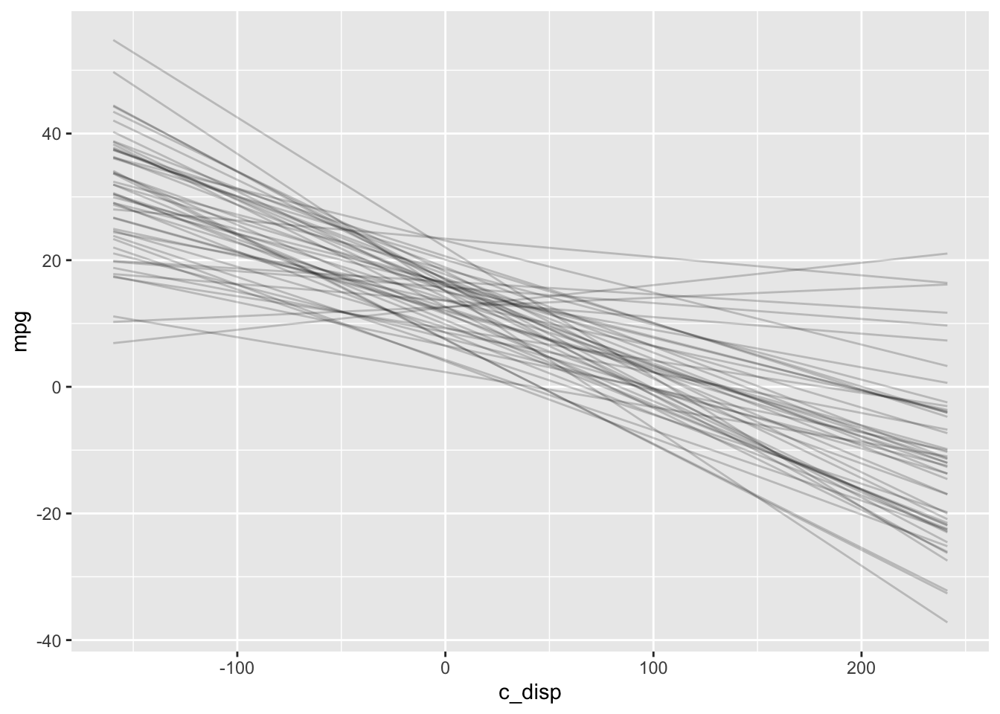
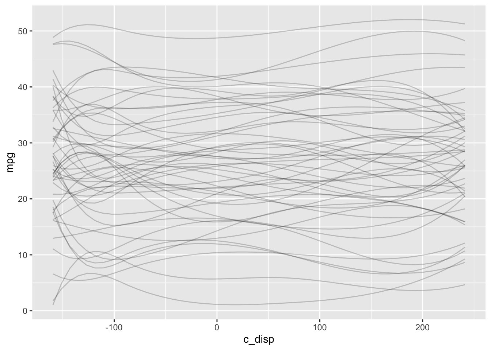
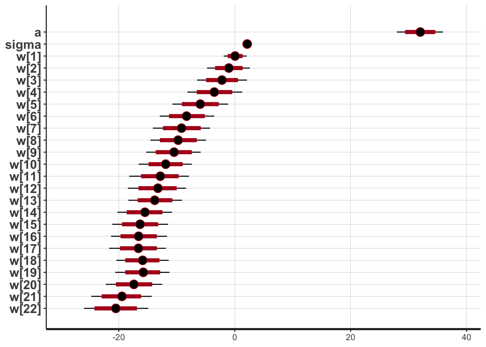
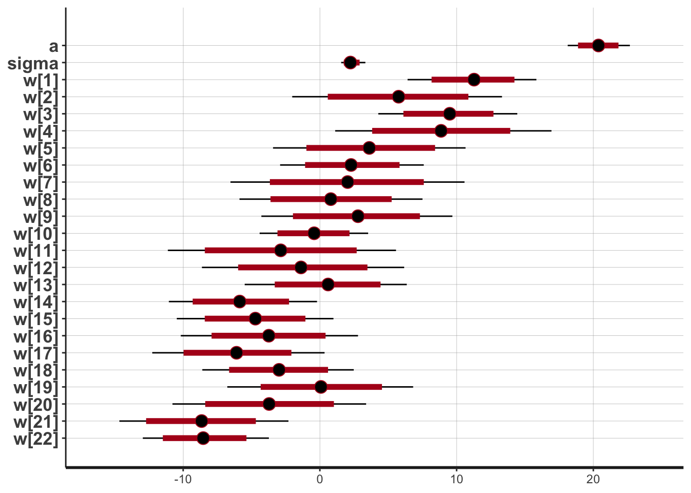

# rstan {#rstan}

## Resources

- [mc-stan online documentation](https://mc-stan.org/users/interfaces/rstan)

## Description

All of the packages in the previous chapters are running `stan` under the hood. One of the biggest advantages to using `rstan` (or `cmdstanr`) is you get the full power and flexibility of `stan` so you can build models that aren't supported by the other packages. The tradeoff is the syntax is quite different which can be a challenge for those who are only familiar with R.

## Environment Setup


```r
rm(list=ls())

set.seed(123)
options("scipen" = 1, "digits" = 4)

library(tidyverse)
library(datasets)
data(mtcars)

library(rstan)
library(bayesplot)

# Saves compiled version of model so it only has to be recompiled if the model is changed
rstan_options(auto_write = TRUE)
# Set number of cores
options(mc.cores = parallel::detectCores()-1)
```

## Linear Model

### Define Model

Like the `rethinking` package, `rstan` doesn't have default priors, so I need to explicitly choose them:

\begin{align*}
  mpg &\sim N(\mu, \sigma^2) \\
  \mu &= a + b*disp \\
  a &\sim N(25,10) \\
  b &\sim N(-0.2, 0.1) \\
  \sigma &\sim Exp(1)
\end{align*}

For a simple linear model there are three sections to the model definition:

1. `data` - This is where the data structures for the known/observed portions of the model (e.g., the number of observations, the number and type of predictors) are defined.

2. `parameters` - This is where the data structures for the parameters to be estimated are defined. For example, the coefficients of the simple linear model belong in this section.

3. `model` - This is where the model (including priors) is defined using the data structures from the previous sections.


```r
# Define model

mdl_code <- '
  data{
    int<lower=1> N;
    vector[N] mpg;
    vector[N] disp;
  }
  parameters{
    real a;
    real b;
    real<lower=0.0> sigma;
  }
  model{
    // Likelihood
    mpg ~ normal(a + b * disp, sigma);
    // Priors
    a ~ normal(25, 10);
    b ~ normal(-0.2, 0.1);
    sigma ~ exponential(1);
  }
'
```

A couple of comments about the model definition.  

1. For those only familiar with R, it may seem like a lot of extra "stuff" is going on in the `data` and `parameters` sections.  This is because `stan` is written in C++ which is statically typed, unlike R and Python which are dynamically typed.  Essentially what that means is you must define the type of any variable before you use it.

2. The `lower=` (and `upper=` not shown in this example) options define bounds for a variable. The data is checked against the bounds which can detect errors pre-compilation. Generally, bounds are a good idea but aren't required.

Next, populate the data structures from the `data` section and save in a list.


```r
mdl_data <- list(N = nrow(mtcars),
                 mpg = mtcars$mpg,
                 disp = mtcars$disp)
```

And this is the call to fit the model.


```r
# Fit model
mdl1 <- stan(model_code=mdl_code, data=mdl_data, model_name="mdl1")
```

```
## Trying to compile a simple C file
```

### Prior Predictive Distribution

I could manually construct the prior predictive distribution like I did in \@ref(rethinkingprior).  Instead I'll have `stan` generate the prior predictive distribution which will be useful for more complex models. First, create another model with just the `data` and `generated quantities` section.  The `generated quantities` section mirrors the `model` section except it is now drawing samples from the priors without conditioning on the observed data. Also, in the `stan` call set the sampling algorithm for fixed parameters.


```r
# Plot prior predictive distribution
mdl_prior <- '
  data{
    int<lower=1> N;
    vector[N] disp;
  }
generated quantities{
  real a_sim = normal_rng(25, 10);
  real b_sim = normal_rng(-0.2, 0.1);
  real sigma_sim = exponential_rng(1);
  real mpg_sim[N] = normal_rng(a_sim + b_sim * disp, sigma_sim);
}
'

N<- 50
D <- seq(min(mtcars$disp), max(mtcars$disp), length.out = N)
mdl_data_prior <- list(N = N, disp=D)

mdl_prior <- stan(model_code=mdl_prior, data=mdl_data_prior, model_name="mdl_prior",
             chains=1, algorithm="Fixed_param")
```

```
## Trying to compile a simple C file
```


```r
draws <- as.data.frame(mdl_prior) %>%
  head(50)

# Expected value prior predictive distribution
exp_mpg_sim <- apply(draws, 1, function(x) x["a_sim"] + x["b_sim"] * (D-mean(mtcars$disp))) %>%
  as.data.frame() %>%
  mutate(disp = D) %>%
  pivot_longer(-c("disp"), names_to="iter", values_to="mpg") 

ggplot() +
  geom_line(data=exp_mpg_sim, mapping=aes(x=disp, y=mpg, group=iter), alpha=0.2) 
```



### Diagnostics


```r
mcmc_rank_overlay(mdl1, pars=c("a", "b", "sigma"))
```


```r
print(mdl1)
```

```
## Inference for Stan model: mdl1.
## 4 chains, each with iter=2000; warmup=1000; thin=1; 
## post-warmup draws per chain=1000, total post-warmup draws=4000.
## 
##         mean se_mean   sd   2.5%    25%    50%    75%  97.5% n_eff Rhat
## a      29.58    0.03 1.21  27.17  28.80  29.56  30.39  31.93  1394    1
## b      -0.04    0.00 0.00  -0.05  -0.04  -0.04  -0.04  -0.03  1444    1
## sigma   3.19    0.01 0.40   2.53   2.92   3.15   3.41   4.07  1553    1
## lp__  -57.58    0.04 1.28 -60.90 -58.16 -57.23 -56.64 -56.15  1298    1
## 
## Samples were drawn using NUTS(diag_e) at Sat Dec 12 15:52:54 2020.
## For each parameter, n_eff is a crude measure of effective sample size,
## and Rhat is the potential scale reduction factor on split chains (at 
## convergence, Rhat=1).
```

### Posterior Distribution

The `print` function above displays information about the posterior distributions in addition to `n_eff`.  Alternatively, the `plot` function provides a graphical display of the posterior distributions.


```r
plot(mdl1, ci_level=0.89)
```

```
## ci_level: 0.89 (89% intervals)
```

```
## outer_level: 0.95 (95% intervals)
```


### Posterior Predictive Distribution

Using the posterior samples, I can plot the expected value of the posterior predictive distribution.


```r
N<- 50
D <- seq(min(mtcars$disp), max(mtcars$disp), length.out = N)

draws <- as.data.frame(mdl1) %>%
  head(50)

# Expected value posterior predictive distribution
post_pred <- apply(draws, 1, function(x) x["a"] + x["b"]*(D-mtcars$disp)) %>%
  as.data.frame() %>%
  mutate(disp = D) %>%
  pivot_longer(-c("disp"), names_to="iter", values_to="mpg") 
```

```
## Warning in D - mtcars$disp: longer object length is not a multiple of shorter
## object length

## Warning in D - mtcars$disp: longer object length is not a multiple of shorter
## object length

## Warning in D - mtcars$disp: longer object length is not a multiple of shorter
## object length

## Warning in D - mtcars$disp: longer object length is not a multiple of shorter
## object length

## Warning in D - mtcars$disp: longer object length is not a multiple of shorter
## object length

## Warning in D - mtcars$disp: longer object length is not a multiple of shorter
## object length

## Warning in D - mtcars$disp: longer object length is not a multiple of shorter
## object length

## Warning in D - mtcars$disp: longer object length is not a multiple of shorter
## object length

## Warning in D - mtcars$disp: longer object length is not a multiple of shorter
## object length

## Warning in D - mtcars$disp: longer object length is not a multiple of shorter
## object length

## Warning in D - mtcars$disp: longer object length is not a multiple of shorter
## object length

## Warning in D - mtcars$disp: longer object length is not a multiple of shorter
## object length

## Warning in D - mtcars$disp: longer object length is not a multiple of shorter
## object length

## Warning in D - mtcars$disp: longer object length is not a multiple of shorter
## object length

## Warning in D - mtcars$disp: longer object length is not a multiple of shorter
## object length

## Warning in D - mtcars$disp: longer object length is not a multiple of shorter
## object length

## Warning in D - mtcars$disp: longer object length is not a multiple of shorter
## object length

## Warning in D - mtcars$disp: longer object length is not a multiple of shorter
## object length

## Warning in D - mtcars$disp: longer object length is not a multiple of shorter
## object length

## Warning in D - mtcars$disp: longer object length is not a multiple of shorter
## object length

## Warning in D - mtcars$disp: longer object length is not a multiple of shorter
## object length

## Warning in D - mtcars$disp: longer object length is not a multiple of shorter
## object length

## Warning in D - mtcars$disp: longer object length is not a multiple of shorter
## object length

## Warning in D - mtcars$disp: longer object length is not a multiple of shorter
## object length

## Warning in D - mtcars$disp: longer object length is not a multiple of shorter
## object length

## Warning in D - mtcars$disp: longer object length is not a multiple of shorter
## object length

## Warning in D - mtcars$disp: longer object length is not a multiple of shorter
## object length

## Warning in D - mtcars$disp: longer object length is not a multiple of shorter
## object length

## Warning in D - mtcars$disp: longer object length is not a multiple of shorter
## object length

## Warning in D - mtcars$disp: longer object length is not a multiple of shorter
## object length

## Warning in D - mtcars$disp: longer object length is not a multiple of shorter
## object length

## Warning in D - mtcars$disp: longer object length is not a multiple of shorter
## object length

## Warning in D - mtcars$disp: longer object length is not a multiple of shorter
## object length

## Warning in D - mtcars$disp: longer object length is not a multiple of shorter
## object length

## Warning in D - mtcars$disp: longer object length is not a multiple of shorter
## object length

## Warning in D - mtcars$disp: longer object length is not a multiple of shorter
## object length

## Warning in D - mtcars$disp: longer object length is not a multiple of shorter
## object length

## Warning in D - mtcars$disp: longer object length is not a multiple of shorter
## object length

## Warning in D - mtcars$disp: longer object length is not a multiple of shorter
## object length

## Warning in D - mtcars$disp: longer object length is not a multiple of shorter
## object length

## Warning in D - mtcars$disp: longer object length is not a multiple of shorter
## object length

## Warning in D - mtcars$disp: longer object length is not a multiple of shorter
## object length

## Warning in D - mtcars$disp: longer object length is not a multiple of shorter
## object length

## Warning in D - mtcars$disp: longer object length is not a multiple of shorter
## object length

## Warning in D - mtcars$disp: longer object length is not a multiple of shorter
## object length

## Warning in D - mtcars$disp: longer object length is not a multiple of shorter
## object length

## Warning in D - mtcars$disp: longer object length is not a multiple of shorter
## object length

## Warning in D - mtcars$disp: longer object length is not a multiple of shorter
## object length

## Warning in D - mtcars$disp: longer object length is not a multiple of shorter
## object length

## Warning in D - mtcars$disp: longer object length is not a multiple of shorter
## object length
```

```r
ggplot() +
  geom_line(data=post_pred, mapping=aes(x=disp, y=mpg, group=iter), alpha=0.2) +
  geom_point(data=mtcars, mapping=aes(x=disp, y=mpg))
```


Note that the expected value of the ppd doesn't include $\sigma$. 

An alternative is to have `stan` automatically generate samples from the posterior predictive distribution by adding a `generated quantities` section to the model (similar to what I did for the prior predictive distribution). 


```r
# Define model

mdl_code_ppd <- '
  data{
    int<lower=1> N;
    vector[N] mpg;
    vector[N] disp;
  }
  parameters{
    real a;
    real b;
    real<lower=0.0> sigma;
  }
  transformed parameters{
    // Expected value of posterior predictive
    vector[N] Y_hat = a + b * disp;
  }
  model{
    // Likelihood
    mpg ~ normal(Y_hat, sigma);
    // Priors
    a ~ normal(25, 10);
    b ~ normal(-0.2, 0.1);
    sigma ~ exponential(1);
  }
  generated quantities{
    // Posterior Predictive
    real mpg_ppd[N] = normal_rng(Y_hat, sigma);
  }
'

# Fit model
mdl1_ppd <- stan(model_code=mdl_code_ppd, data=mdl_data)
```

```
## Trying to compile a simple C file
```

```r
draws <- as.data.frame(mdl1_ppd)

# 95% credible interval for expected value of ppd
Eppd <- draws %>% select(starts_with("Y_hat")) %>%
  apply(2, function(x) quantile(x, probs=c(0.025, 0.5, 0.975))) %>%
  t() %>%
  as.data.frame() %>%
  mutate(disp = mtcars$disp)

# 95 credible interval for ppd
ppd <- draws %>% select(starts_with("mpg_ppd")) %>%
  apply(2, function(x) quantile(x, probs=c(0.025, 0.5, 0.975))) %>%
  t() %>%
  as.data.frame() %>%
  mutate(disp=mdl_data$disp)
  
ggplot() +
  geom_line(data=Eppd, mapping=aes(x=disp, y=`50%`)) +
  geom_ribbon(data=ppd, mapping=aes(x=disp, ymin=`2.5%`, ymax=`97.5%`), 
              alpha=0.5, fill="lightblue") +
  geom_ribbon(data=Eppd, mapping=aes(x=disp, ymin=`2.5%`, ymax=`97.5%`), 
              alpha=0.5, fill="dodgerblue") +
  geom_point(data=mtcars, mapping=aes(x=disp, y=mpg)) +
  labs(x="disp", y="mpg")
```


The darker blue area is a 95% credible interval for the expected value of the posterior predictive distribution and the lighter blue area is the 95% credible interval for the posterior predictive distribution.

## Semi-parametric Model

### Define Model

First, I'll define the splines just as I did with the `rethinking` package.  


```r
library(splines)

num_knots <- 4  # number of interior knots
knot_list <- quantile(mtcars$disp, probs=seq(0,1,length.out = num_knots))
B <- bs(mtcars$disp, knots=knot_list[-c(1,num_knots)], intercept=TRUE)

df1 <- cbind(disp=mtcars$disp, B) %>%
  as.data.frame() %>%
  pivot_longer(-disp, names_to="spline", values_to="val")

# Plot at smaller intervals so curves are smooth
N<- 50
D <- seq(min(mtcars$disp), max(mtcars$disp), length.out = N)
B_plot <- bs(D, 
             knots=knot_list[-c(1,num_knots)], 
             intercept=TRUE)

df2 <- cbind(disp=D, B_plot) %>%
  as.data.frame() %>%
  pivot_longer(-disp, names_to="spline", values_to="val")

ggplot(mapping=aes(x=disp, y=val, color=spline)) +
  geom_point(data=df1) +
  geom_line(data=df2, linetype="dashed")
```


Note: the dashed lines are the splines and the points are the values of the spline at the specific values of `mtcars$disp`; the points are inputs into the `stan` model.


```r
# Define model

mdl_code <- '
  data{
    int<lower=1> N;
    int<lower=1> num_basis;
    vector[N] mpg;
    vector[N] disp;
    matrix[N, num_basis] B;
  }
  parameters{
    real a;
    real<lower=0.0> sigma;
    vector[num_basis] w;
  }
  transformed parameters{
    vector[N] Y_hat = a + B*w;
  }
  model{
    // Likelihood
    mpg ~ normal(Y_hat, sigma);
    // Priors
    a ~ normal(25, 10);
    sigma ~ exponential(1);
    w ~ normal(0, 5);
  }
  generated quantities{
    // Posterior Predictive
    real mpg_ppd[N] = normal_rng(Y_hat, sigma);
  }
'

mdl_data <- list(N=nrow(mtcars),
                 num_basis=ncol(B),
                 B=B,
                 mpg = mtcars$mpg,
                 disp = mtcars$disp)

# Fit model
mdl1_gam <- stan(model_code=mdl_code, data=mdl_data)
```

```
## Trying to compile a simple C file
```

### Prior Predictive Distribution


```r
# Define model

mdl2 <- '
  data{
    int<lower=1> N;
    int<lower=1> num_basis;
    //vector[N] mpg;
    //vector[N] disp;
    matrix[N, num_basis] B;
  }
  generated quantities{
    real a_sim = normal_rng(25, 10);
    real sigma_sim = exponential_rng(1);
    real mpg_sim[N];
    vector[N] Y_hat;
    vector[num_basis] w_sim;
    for (i in 1:num_basis)
      w_sim[i] = normal_rng(0,5);
    Y_hat = a_sim + B * w_sim;
    mpg_sim = normal_rng(Y_hat, sigma_sim);
}
'

mdl_gam_prior <- stan(model_code=mdl2, 
                      data=list(N=N, 
                                num_basis=ncol(B_plot),
                                B=B_plot),
                      chains=1, algorithm="Fixed_param")
```

```
## Trying to compile a simple C file
```

```r
draws <- as.data.frame(mdl_gam_prior) %>%
  head(50)

# Expected value prior predictive distribution
exp_mpg_sim <- apply(draws, 1, function(x) {
  x["a_sim"] + B_plot %*% x[grepl("w", names(x))]
}) %>%
  as.data.frame() %>%
  mutate(disp = D) %>%
  pivot_longer(-c("disp"), names_to="iter", values_to="mpg") 

# 95% interval prior predictive distribution
mpg_sim <- as.data.frame(mdl_gam_prior) %>% select(starts_with("mpg")) %>%
  apply(2, function(x) quantile(x, probs=c(0.025, 0.5, 0.975))) %>%
  t() %>%
  as.data.frame() %>%
  mutate(disp = D)

ggplot() +
  geom_line(data=exp_mpg_sim, mapping=aes(x=disp, y=mpg, group=iter), alpha=0.2) +
  geom_ribbon(data=mpg_sim, mapping=aes(x=disp, ymin=`2.5%`, ymax=`97.5%`), 
              alpha=0.5, fill="lightblue")
```



### Diagnostics


```r
# Note that bayesplot methods support tidy selection of parameters
mcmc_rank_overlay(mdl1_gam, pars=vars(a, sigma, starts_with("w")))
```


```r
# This is the print.stanfit method and pars must be a character vector
print(mdl1_gam, pars=c("a", "sigma", "w"))
```

```
## Inference for Stan model: 82641c24a01364d6c7401a2add0dc8c4.
## 4 chains, each with iter=2000; warmup=1000; thin=1; 
## post-warmup draws per chain=1000, total post-warmup draws=4000.
## 
##        mean se_mean   sd   2.5%    25%   50%   75% 97.5% n_eff Rhat
## a     20.30    0.06 2.06  16.49  18.88 20.28 21.70 24.31  1063    1
## sigma  2.23    0.01 0.32   1.71   2.01  2.20  2.42  2.98  1929    1
## w[1]  11.77    0.07 2.42   7.13  10.13 11.78 13.42 16.43  1210    1
## w[2]   4.25    0.07 2.66  -1.11   2.49  4.28  6.07  9.47  1603    1
## w[3]  -0.69    0.08 2.85  -6.23  -2.64 -0.66  1.26  4.79  1372    1
## w[4]  -5.78    0.07 3.00 -11.67  -7.75 -5.80 -3.80  0.18  1618    1
## w[5]  -2.47    0.08 3.03  -8.47  -4.52 -2.41 -0.46  3.59  1536    1
## w[6]  -8.91    0.07 2.53 -13.84 -10.64 -8.88 -7.11 -4.02  1487    1
## 
## Samples were drawn using NUTS(diag_e) at Sat Dec 12 15:54:45 2020.
## For each parameter, n_eff is a crude measure of effective sample size,
## and Rhat is the potential scale reduction factor on split chains (at 
## convergence, Rhat=1).
```

### Posterior Distribution


```r
plot(mdl1_gam, pars=c("a", "sigma", "w"))
```

```
## ci_level: 0.8 (80% intervals)
```

```
## outer_level: 0.95 (95% intervals)
```


### Posterior Predictive Distribution


```r
# 95% credible interval expected value of posterior predictive
Eppd <- as.data.frame(mdl1_gam) %>% select(starts_with("Y_hat")) %>%
  apply(2, function(x) quantile(x, probs=c(0.025, 0.5, 0.975))) %>%
  t() %>%
  as.data.frame() %>%
  mutate(disp = mtcars$disp)

# 95% credible interval posterior predictive
ppd <- as.data.frame(mdl1_gam) %>% select(starts_with("mpg")) %>%
  apply(2, function(x) quantile(x, probs=c(0.025, 0.5, 0.975))) %>%
  t() %>%
  as.data.frame() %>%
  mutate(disp = mtcars$disp)

ggplot() +
  geom_line(data=Eppd, mapping=aes(x=disp, y=`50%`)) +
  geom_ribbon(data=ppd,
              mapping=aes(x=disp, ymin=`2.5%`, ymax=`97.5%`), 
              alpha=0.5, fill="lightblue") +
    geom_ribbon(data=Eppd, mapping=aes(x=disp, ymin=`2.5%`, ymax=`97.5%`), 
              alpha=0.5, fill="dodgerblue") +
  geom_point(data=mtcars, mapping=aes(x=disp, y=mpg)) +
  labs(x="disp", y="mpg")
```


## Semi-parametric Model (Random Walk Prior)

### Define Model

One challenge with splines is choosing the number of knots.  For the previous model, I tried several values for `num_knots` until settling on 4.  However, there is a `stan` case study for splines that uses a novel prior which addresses this issue.  The details are [here](https://mc-stan.org/users/documentation/case-studies/splines_in_stan.html).

For this example, I will set `num_knots=20` and then fit models with and without the random walk prior. This is an example where the `rstan`'s flexibility is an advantage because it would be difficult or impossible to specify the random walk prior in the other packages.


```r
library(splines)

num_knots <- 20  # number of interior knots
knot_list <- quantile(mtcars$disp, probs=seq(0,1,length.out = num_knots))
B <- bs(mtcars$disp, knots=knot_list[-c(1,num_knots)], intercept=TRUE)

# Define model with smoothing prior
mdl_smooth_code <- '
  data{
    int<lower=1> N;
    int<lower=1> num_basis;
    vector[N] mpg;
    vector[N] disp;
    matrix[N, num_basis] B;
  }
  parameters{
    real a;
    real<lower=0.0> sigma;
    vector[num_basis] w_raw;
    real<lower=0.0> tau;
  }
  transformed parameters{
    vector[num_basis] w;
    vector[N] Y_hat;
    w[1] = w_raw[1];
    for (i in 2:num_basis)
      w[i] = w[i-1] + w_raw[i]*tau;
    Y_hat = a + B*w;
  }
  model{
    // Likelihood
    mpg ~ normal(Y_hat, sigma);
    // Priors
    a ~ normal(25, 10);
    sigma ~ exponential(1);
    w_raw ~ normal(0, 1);
    tau ~ normal(0,1);
  }
  generated quantities{
    real mpg_ppd[N] = normal_rng(a + B*w, sigma);
  }
'

mdl_data <- list(N=nrow(mtcars), 
                 num_basis=ncol(B),
                 B=B,
                 mpg = mtcars$mpg,
                 disp = mtcars$disp)

# Fit model with smoothing prior
mdl2_gam_smooth <- stan(model_code=mdl_smooth_code, data=mdl_data,
                 control=list(adapt_delta=0.99))
```

```
## Trying to compile a simple C file
```

```r
# Fit model without smoothing prior
mdl2_gam <- stan(model_code = mdl_code, data=mdl_data,
                 control=list(adapt_delta=0.99))
```

### Diagnostics


```r
mcmc_rank_overlay(mdl2_gam_smooth, pars=vars("a", "sigma", starts_with("w")))
```


```r
print(mdl2_gam_smooth, pars=c("a", "sigma", "w"))
```

```
## Inference for Stan model: 38c293991ee2b9bb0106a5b740561b9f.
## 4 chains, each with iter=2000; warmup=1000; thin=1; 
## post-warmup draws per chain=1000, total post-warmup draws=4000.
## 
##         mean se_mean   sd   2.5%    25%    50%    75%  97.5% n_eff Rhat
## a      32.01    0.04 2.02  28.08  30.69  32.04  33.36  35.97  3196    1
## sigma   2.17    0.01 0.32   1.64   1.95   2.13   2.37   2.90  2955    1
## w[1]    0.06    0.01 1.01  -1.89  -0.60   0.06   0.72   2.00  4659    1
## w[2]   -1.07    0.03 1.93  -4.92  -2.33  -1.03   0.20   2.65  3383    1
## w[3]   -2.20    0.04 2.14  -6.49  -3.65  -2.20  -0.81   2.04  3624    1
## w[4]   -3.52    0.04 2.36  -8.15  -5.11  -3.57  -1.97   1.08  3938    1
## w[5]   -5.96    0.04 2.47 -10.99  -7.56  -5.92  -4.27  -1.35  3354    1
## w[6]   -8.29    0.04 2.37 -12.92  -9.82  -8.31  -6.71  -3.69  3078    1
## w[7]   -9.18    0.04 2.50 -14.17 -10.84  -9.18  -7.46  -4.38  3507    1
## w[8]   -9.75    0.04 2.41 -14.48 -11.33  -9.77  -8.14  -5.01  3846    1
## w[9]  -10.53    0.04 2.43 -15.40 -12.09 -10.52  -8.93  -5.75  3839    1
## w[10] -11.98    0.04 2.27 -16.47 -13.46 -11.99 -10.45  -7.47  3228    1
## w[11] -12.99    0.05 2.57 -18.13 -14.63 -12.97 -11.24  -8.06  3187    1
## w[12] -13.31    0.04 2.57 -18.42 -14.98 -13.29 -11.64  -8.22  3449    1
## w[13] -13.84    0.04 2.38 -18.49 -15.38 -13.82 -12.31  -9.16  3797    1
## w[14] -15.60    0.04 2.42 -20.37 -17.17 -15.59 -14.01 -10.84  2957    1
## w[15] -16.38    0.05 2.44 -21.20 -17.98 -16.40 -14.74 -11.46  2802    1
## w[16] -16.61    0.04 2.52 -21.62 -18.30 -16.61 -14.91 -11.71  3392    1
## w[17] -16.68    0.04 2.42 -21.39 -18.29 -16.66 -15.06 -12.05  3295    1
## w[18] -15.90    0.04 2.31 -20.49 -17.40 -15.93 -14.37 -11.36  3491    1
## w[19] -15.83    0.04 2.47 -20.86 -17.40 -15.80 -14.24 -10.98  4198    1
## w[20] -17.44    0.04 2.52 -22.56 -19.10 -17.44 -15.75 -12.64  4156    1
## w[21] -19.55    0.05 2.64 -24.68 -21.32 -19.56 -17.77 -14.40  3178    1
## w[22] -20.51    0.05 2.75 -25.90 -22.40 -20.52 -18.65 -15.02  3126    1
## 
## Samples were drawn using NUTS(diag_e) at Sat Dec 12 15:56:16 2020.
## For each parameter, n_eff is a crude measure of effective sample size,
## and Rhat is the potential scale reduction factor on split chains (at 
## convergence, Rhat=1).
```

### Posterior Distribution


```r
plot(mdl2_gam_smooth, pars=c("a", "sigma", "w"))
plot(mdl2_gam, pars=c("a", "sigma", "w"))
```



### Posterior Predictive Distribution


```r
draws <- as.data.frame(mdl2_gam) %>% head(100)

Epost_pred <- draws %>% select(starts_with("Y_hat")) %>%
  apply(2, function(x) quantile(x, probs=c(0.055, 0.5, 0.945))) %>%
  t() %>%
  as.data.frame() %>%
  mutate(disp = mtcars$disp)

draws_smooth <- as.data.frame(mdl2_gam_smooth) %>% head(100)

Epost_pred_smooth <- draws_smooth %>% select(starts_with("Y_hat")) %>%
  apply(2, function(x) quantile(x, probs=c(0.055, 0.5, 0.945))) %>%
  t() %>%
  as.data.frame() %>%
  mutate(disp = mtcars$disp)

rbind(Epost_pred %>% select(c("disp", `50%`)) %>% mutate(type="without smoothing prior"),
      Epost_pred_smooth %>% select(c("disp", `50%`)) %>% mutate(type="with smoothing prior")) %>%
  ggplot() +
  geom_line( mapping=aes(x=disp, y=`50%`, linetype=type), color="blue" ) +
  geom_point(data=mtcars, mapping=aes(x=disp, y=mpg)) +
  labs(y="mpg")
```


The plot above shows that even with a large number of knots (in this case 20), the model with the smoothing prior significantly reduces over-fitting when compared to the model without the smoothing prior.

## Session Info


```r
sessionInfo()
```

```
## R version 4.0.3 (2020-10-10)
## Platform: x86_64-apple-darwin17.0 (64-bit)
## Running under: macOS Big Sur 10.16
## 
## Matrix products: default
## BLAS:   /Library/Frameworks/R.framework/Versions/4.0/Resources/lib/libRblas.dylib
## LAPACK: /Library/Frameworks/R.framework/Versions/4.0/Resources/lib/libRlapack.dylib
## 
## locale:
## [1] en_US.UTF-8/en_US.UTF-8/en_US.UTF-8/C/en_US.UTF-8/en_US.UTF-8
## 
## attached base packages:
## [1] splines   stats     graphics  grDevices datasets  utils     methods  
## [8] base     
## 
## other attached packages:
##  [1] bayesplot_1.7.2      rstan_2.21.2         StanHeaders_2.21.0-6
##  [4] forcats_0.5.0        stringr_1.4.0        dplyr_1.0.2         
##  [7] purrr_0.3.4          readr_1.4.0          tidyr_1.1.2         
## [10] tibble_3.0.4         ggplot2_3.3.2        tidyverse_1.3.0     
## 
## loaded via a namespace (and not attached):
##  [1] httr_1.4.2         jsonlite_1.7.1     modelr_0.1.8       RcppParallel_5.0.2
##  [5] assertthat_0.2.1   stats4_4.0.3       renv_0.12.0        cellranger_1.1.0  
##  [9] yaml_2.2.1         pillar_1.4.7       backports_1.2.0    glue_1.4.2        
## [13] digest_0.6.27      rvest_0.3.6        colorspace_2.0-0   htmltools_0.5.0   
## [17] plyr_1.8.6         pkgconfig_2.0.3    broom_0.7.2        haven_2.3.1       
## [21] bookdown_0.21      scales_1.1.1       processx_3.4.5     farver_2.0.3      
## [25] generics_0.1.0     ellipsis_0.3.1     withr_2.3.0        cli_2.2.0         
## [29] magrittr_2.0.1     crayon_1.3.4       readxl_1.3.1       evaluate_0.14     
## [33] ps_1.4.0           fs_1.5.0           fansi_0.4.1        xml2_1.3.2        
## [37] pkgbuild_1.1.0     tools_4.0.3        loo_2.3.1          prettyunits_1.1.1 
## [41] hms_0.5.3          lifecycle_0.2.0    matrixStats_0.57.0 V8_3.4.0          
## [45] munsell_0.5.0      reprex_0.3.0       callr_3.5.1        compiler_4.0.3    
## [49] rlang_0.4.9        grid_4.0.3         ggridges_0.5.2     rstudioapi_0.13   
## [53] labeling_0.4.2     rmarkdown_2.5      gtable_0.3.0       codetools_0.2-16  
## [57] inline_0.3.17      DBI_1.1.0          curl_4.3           reshape2_1.4.4    
## [61] R6_2.5.0           gridExtra_2.3      lubridate_1.7.9.2  knitr_1.30        
## [65] stringi_1.5.3      parallel_4.0.3     Rcpp_1.0.5         vctrs_0.3.5       
## [69] dbplyr_2.0.0       tidyselect_1.1.0   xfun_0.19
```

